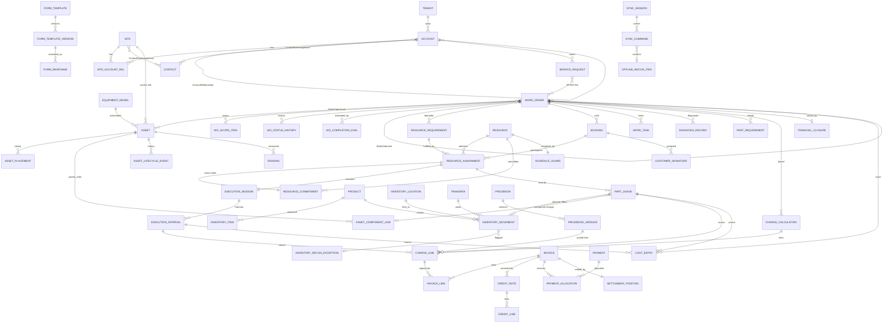

# Servexa Logical Data Model v1.1 — Approved Baseline

**Status:** APPROVED BASELINE — Ready for Physical Data Model handoff
**Sources read:** Master PRD v1.1 (Approved Baseline) · Event Storming & Domain Validation v1.0 · ADRs v1.0 · UX Information Architecture v1.0
**Not attached:** Master Domain Discovery v1.0. Its semantics are consumed only through the PRD (which declares itself derived from it). No Discovery-only claims are made here.
**Authority order applied:** PRD → Event Storming → ADRs → UX IA.
**Scope:** Logical model only. No SQL types, DDL, EF mappings, APIs, or code.

---

## 1. Executive Architecture/Data Summary

Servexa's logical data model has **11 modules** inside one modular monolith and one SQL Server database (ADR-001): `Platform`, `Customers`, `Assets`, `Service`, `Scheduling`, `FieldExecution`, `Inventory`, `Commercial`, `Payments`, `JobCosting`, `Contracts` (R3, boundary-only). Each module owns its records. Cross-module links are **identity references only**, never ownership and never navigation-based mutation.

The model rests on seven structural commitments:

1. **Distinct lifecycles are distinct records.** Service Request, Work Order, Booking, Resource Assignment, Execution Session, Part Usage, Inventory Movement, Charge, Invoice Line, Payment Allocation and Cost Entry are all separate records with separate owners. None is a status of another.
2. **Completion is a chain of three independent transitions.** Assignment completion → Booking completion → Work Order completion *evaluation*. The evaluation is persisted as its own record, so "why the WO closed or paused" is reconstructable.
3. **Capacity is committed through a `ResourceCommitment` record**. Candidate search persists nothing. The no-overlap invariant is enforced at commit time through a narrow resource-level concurrency boundary; the physical locking mechanism is intentionally deferred to physical design. Assignments are not nested inside Resource or Work Order.
4. **Physical stock truth is a double-entry-style movement ledger.** Balances are rebuildable projections. Part Usage (operational fact), Movement (physical fact), Charge (price fact) and Cost Entry (internal cost fact) are four separate records linked by reference.
5. **Money is split into five facts:** Charge Line → Invoice Line → Credit Note Line (compensation) → Payment Allocation / Credit Application (settlement) → Cost Entry (internal). A Posted Invoice never changes. Its *settlement position* lives in Payments.
6. **Offline is modeled as command identity + dual timestamps + sync status + conflict reference** (`SyncCommandRecord`, `OfflineReconciliationItem`). It is not a flag on Booking. Evidence and physical-usage facts survive; authoritative lifecycle state is never overwritten.
7. **History is explicit.** Status-history ledgers, effective-dated versions, append-only ledgers and immutable-on-finalization records are named per entity (§20, §21). `UpdatedAt` never stands in for business history.

**Scale of the model.** About 105 logical entities. About 55 are aggregate roots, the rest are children, ledger records, or reference/relationship records. R1-critical entities are marked **[R1]**, R1.5 hardening **[R1.5]**, later-release **[R2]/[R3]/[R4]**. Later-release structures are defined only enough to avoid data-model dead ends.

---

## 2. Modeling Principles

### 2.1 Conventions used in every entity card

| Code | Meaning |
|---|---|
| **T1** | `TenantId` mandatory. Every reference stays inside the same tenant. All business uniqueness is tenant-scoped. Tenant is set server-side (ADR-002). |
| **TG** | Global/shared reference data. No `TenantId`. Listed in §17.2. |
| **C-OPT** | Optimistic concurrency token on the aggregate root. A stale write is rejected with conflict (ADR-004). |
| **C-GUARD** | Optimistic token plus a narrow consistency guard for a cross-record invariant. |
| **C-NONE** | Immutable or append-only. No token needed. Correctness comes from uniqueness and idempotency. |
| **H-M** | Mutable operational state. Material changes are captured in `AuditRecord`. |
| **H-S** | Mutable with a dedicated status/transition history ledger. |
| **H-A** | Append-only. Never updated. Corrections are compensating rows. |
| **H-V** | Versioned/effective-dated. Published versions are immutable. |
| **H-I** | Immutable once finalized/posted/signed. |
| **D-1** | No hard delete once referenced. Use inactive/archived/cancelled states. |
| **D-2** | Financial/audit retention applies. Purge only after the retention and legal-hold check. |
| **D-3** | Purge-eligible after a configured retention (telemetry, transient records). |
| **D-4** | Hard delete allowed only while Draft and unreferenced. |

### 2.2 Standard attribute envelope (not repeated per entity)

- **Identity.** Every record has a surrogate `Id` that is globally unique and not tenant-sequential. Records created offline (Part Usage, Execution Interval, Form Response, Evidence, Reading, Task update) take a **client-generated `Id`**. The server validates tenant and uniqueness, and replay is keyed by `CommandId` (§19).
- **Business number.** Human-facing numbers (Account, WO, Invoice…) are separate from `Id`, tenant-scoped, and issued from `NumberSeries` (§5).
- **Roots** carry `ConcurrencyToken`, `CreatedAt/By`, `ModifiedAt/By`. Children inherit the root's token.
- **Instants vs local time.** Business instants are stored as canonical instants. Where a decision depends on local time (SLA, site access window, shift), the governing **timezone identifier is stored alongside** (PRD NFR Localization).
- **Retry-sensitive creators** also carry `SourceCommandId`.
- **Audit metadata.** Every state-changing command writes `AuditRecord`s (§5). Entity cards say "audit: standard" unless something extra is needed.
- **Visibility attribute.** Content that can reach a customer carries `Visibility ∈ {Internal, CustomerVisible}`, default `Internal`.

### 2.3 Modeling rules

- **R-01** An aggregate protects one consistency rule set and is loaded whole. Unbounded or historical collections are separate records that point at the root.
- **R-02** Cross-aggregate and cross-module links are by `Id` only. The owning module is the only mutator.
- **R-03** One authoritative home per business fact. Read models never become sources of truth.
- **R-04** A status that has business consequence gets a transition history. Cheap status flags don't.
- **R-05** Snapshots, not live lookups, wherever history must survive later change (price rule, entitlement, SLA policy, form version, bill-to, address).
- **R-06** Compensation, not mutation, for ledger and posted records.
- **R-07** Policy vs invariant (PRD §4): tenant configuration changes policy values. It never removes an invariant named in §27.
- **R-08** No infrastructure concepts as entities, except the platform records ADR-004/006/007/008 require (idempotency, outbox/inbox, work item, file metadata).
- **R-09** AI is not a system of record. No AI-authored fact is stored without a human-confirmed command. AI-draft content is stored only as `Draft` text inside the owning entity. No knowledge/vector structures are modeled (ADR-010).

---

## 3. Module Ownership Matrix

| Module | Logical schema | Owns (authoritative) | References from others (ID only) | Key facts published |
|---|---|---|---|---|
| **Platform** | `platform` | Tenant, Branch, Territory, TenantUser, Role/Permission, RoleAssignment+Scope, PolicySetting, FeatureFlag, NumberSeries, ApprovalRequest/Decision, FileObject, AuditRecord, IdempotencyRecord, Outbox/Inbox, DurableWorkItem, DeviceRegistration | TenantId, UserId, BranchId, TerritoryId, FileId, ApprovalId | PermissionChanged, TenantSuspended |
| **Customers** | `customers` | Account, Contact, Site and their relationship/role records | AccountId, ContactId, SiteId | SiteDeactivated, AccountCreditHoldChanged |
| **Assets** | `assets` | Manufacturer, EquipmentModel, Asset, ownership/placement/component/lifecycle history | AssetId, EquipmentModelId | AssetMoved, ComponentReplaced, AssetDecommissioned |
| **Service** | `service` | ServiceRequest, WorkOrder (+Asset, ScopeItem), status history, completion evaluation, scope-change request, service report, notes | WorkOrderId, ServiceRequestId | WorkOrderCreated/Approved/Paused/OperationallyCompleted/Reopened |
| **Scheduling** | `scheduling` | Resource & qualifications, calendars, ResourceRequirement, Booking, ResourceAssignment, ResourceCommitment, scheduling consistency boundary | ResourceId, BookingId, AssignmentId | BookingScheduled/Dispatched/Cancelled/Completed, ResourceAssigned/Reassigned, SchedulingConflictDetected |
| **FieldExecution** | `field` | ExecutionSession, WorkTask, forms, FormResponse, Reading, Diagnosis, Evidence, Signature, **PartUsage**, sync/offline records | PartUsageId, ExecutionIntervalId, FormResponseId | PartUsageRecorded, AssignmentCompleted, CustomerSignatureCaptured, OfflineExecutionConflictDetected |
| **Inventory** | `inventory` | Product, Lot, InventoryItem, Location, **Movement ledger**, StockBalance projection, Reservation, Transfer, PartRequirement, Adjustment, RMA, Disposition, ReconciliationException | ProductId, InventoryItemId, MovementId | PartConsumed, RequiredPartUnavailable, PartAvailable, InventoryReconciliationExceptionCreated |
| **Commercial** | `billing` | Pricebooks, ServiceCatalogItem, TaxCategory, Estimate, ChargeCalculation, Invoice, CreditNote, correction link, FinancialClosure | InvoiceId, CreditNoteId, ChargeLineId | ChargesCalculated, InvoicePosted, CreditNoteIssued, WorkOrderFinanciallyClosed |
| **Payments** | `payments` | Payment, Allocation, CreditApplication, InvoiceSettlementPosition, Refund, PaymentIntent | PaymentId | PaymentRecorded, PaymentAllocated, RefundIssued |
| **JobCosting** | `jobcost` | CostRate, CostEntry | CostEntryId | JobCostPosted |
| **Contracts** *(R3; boundary only)* | `contracts` | ServicePlan, Agreement(+Version), Entitlement decision/allowance, Warranty/Claim, SLA policy/instance, BusinessCalendar, Maintenance plan/template/occurrence, Agreement billing occurrence | EntitlementDecisionId, SlaInstanceId, MaintenanceOccurrenceId | EntitlementEvaluated, SlaBreached, MaintenanceOccurrenceGenerated |

**Dependency direction (compile-time):** `Platform` ← everything. `Customers` ← `Assets`, `Service`. `Service` ← `Scheduling`, `FieldExecution`, `Commercial`. `Scheduling` ← `FieldExecution`. `FieldExecution` → `Inventory` and `JobCosting` via events or contracts. `Commercial` ← `Payments`. No module references a downstream module's tables. Everything else flows through contracts and outbox events (§25).

---

## 4. Aggregate Root Catalogue

Children are listed in the entity sections. "Consistency boundary" means what changes atomically under the root's token (or guard).

| Aggregate Root | Module | Primary responsibility | Consistency boundary |
|---|---|---|---|
| Tenant | Platform | Tenant lifecycle/status | Tenant status and settings |
| Branch / Territory | Platform | Org scope units | Own record |
| TenantUser | Platform | Tenant membership + external identity link | User status, identity links |
| Role | Platform | Capability bundle | Role + its permission set |
| RoleAssignment | Platform | Role + scope grant to a user | One grant, with its scopes |
| PolicySetting / FeatureFlag | Platform | Versioned tenant policy | One setting version chain |
| NumberSeries | Platform | Business-number issuance | Series counter (guarded) |
| ApprovalRequest | Platform | Generic approval state | Request + its decisions |
| FileObject | Platform | Binary metadata | File metadata + scan status |
| IdempotencyRecord · OutboxMessage · InboxMessage · DurableWorkItem | Platform | Reliability records | Each is its own unit |
| DeviceRegistration | Platform | Registered field device | Device status |
| Account | Customers | Customer/billing identity | Account attributes, billing terms, status |
| Contact | Customers | Human identity | Contact details/status |
| Site | Customers | Service location | Site profile, hazards, windows |
| AccountRelationship · SiteAccountRelationship · ContactRoleAssignment | Customers | Effective-dated relationships | Single relationship record |
| Manufacturer · EquipmentModel | Assets | Equipment catalogue | Own record |
| Asset | Assets | Installed equipment identity/state | Asset status, current site/placement pointer, current ownership pointer |
| AssetOwnership · AssetPlacement · AssetComponentLink · AssetLifecycleEvent | Assets | History records | Each record |
| ServiceRequest | Service | Unverified demand + triage | Request fields, triage state, request-asset set |
| WorkOrder | Service | Authorized work + operational status | Header, WorkOrderAsset set, ScopeItem set, status |
| WorkOrderCompletionEvaluation · WorkOrderStatusHistory · WorkOrderLink | Service | History/relationship ledgers | Append-only |
| ScopeChangeRequest | Service | Field-discovered extra scope | Request + approval link |
| ServiceReport | Service | Curated customer report | Report versions + publication state |
| Resource | Scheduling | Schedulable capacity unit + qualifications | Resource profile, skills, certifications |
| WorkingTimeProfile · AvailabilityException | Scheduling | Calendar facts | Each record |
| ResourceRequirement | Scheduling | Demand for capacity on a WO | Requirement + its skill/cert needs |
| Booking | Scheduling | Customer visit envelope | Booking window, lifecycle state, schedule revisions pointer |
| ResourceAssignment | Scheduling | One resource's participation in a Booking | Assignment state, role, planned interval |
| ResourceCommitment | Scheduling | Committed exclusive interval | Single interval record (no-overlap invariant) |
| BookingScheduleRevision · SchedulingConflictLog | Scheduling | History | Append-only |
| ExecutionSession | FieldExecution | One assignment's travel/work truth | Session + its intervals |
| WorkTask | FieldExecution | Task/checklist item instance | Task state |
| FormTemplate | FieldExecution | Template identity + version chain | Template + versions |
| FormResponse | FieldExecution | Completed/in-progress inspection form | Response + answers |
| Reading · EvidenceItem · CustomerSignature | FieldExecution | Captured field facts | Each record |
| DiagnosisRecord | FieldExecution | Diagnosis/root cause/resolution | Record + RootCause + Resolution |
| PartUsage | FieldExecution | Operational physical usage fact | Single usage record |
| SyncSession · SyncCommandRecord | FieldExecution | Offline command intake | Per command |
| OfflineReconciliationItem | FieldExecution | Office work item for sync conflicts | Item state |
| Product | Inventory | Catalogue identity + tracking policy | Product + UOM conversions |
| InventoryLot · InventoryItem | Inventory | Lot / serialized identity | Item state + custody pointer |
| InventoryLocation | Inventory | Place stock is held | Location attributes |
| InventoryMovement | Inventory | Physical stock ledger | Append-only single row |
| StockBalance | Inventory | Rebuildable balance projection | Balance row (version-guarded) |
| Reservation | Inventory | Soft claim on stock | Reservation state |
| Transfer | Inventory | Inter-location movement document | Transfer + lines |
| PartRequirement | Inventory | Part demand/readiness for a WO | Requirement state |
| InventoryAdjustment | Inventory | Counted/approved stock correction | Header + lines |
| RmaCase | Inventory | Return/defect handling | Case + lines |
| InventoryReconciliationException | Inventory | Physical vs digital discrepancy item | Exception state |
| Pricebook | Commercial | Price source identity | Pricebook + version chain |
| ServiceCatalogItem · TaxCategory | Commercial | Billable non-stock items; tax reference | Own record |
| Estimate *(R2)* | Commercial | Versioned proposal | Estimate + versions |
| ChargeCalculation | Commercial | Explained charge lines for a WO | Calculation + lines |
| Invoice | Commercial | Customer financial document | Header + lines (frozen on posting) |
| CreditNote | Commercial | Compensating document | Header + lines |
| InvoiceCorrectionLink | Commercial | Original ↔ credit ↔ rebill relationship | Link record |
| FinancialClosure | Commercial | Financial gate evaluation + closure | Closure + evaluations |
| Payment | Payments | Cash receipt fact | Payment + status history |
| PaymentAllocation · CreditApplication | Payments | Settlement ledger | Append-only |
| InvoiceSettlementPosition | Payments | Per-invoice outstanding guard | Position (version-guarded) |
| Refund · PaymentIntent | Payments | Cash-out; gateway intent | Own record |
| CostRate | JobCosting | Effective-dated cost rates | Rate version chain |
| CostEntry | JobCosting | Internal cost ledger | Append-only |
| ServicePlan · ServiceAgreement *(R3)* | Contracts | Plan template; signed agreement versions | Version chain |
| Warranty · WarrantyClaim *(R3)* | Contracts | Coverage; recovery | Each aggregate |
| EntitlementDecision *(R3)* | Contracts | Snapshot of coverage evaluation | Immutable snapshot |
| SlaPolicy · SlaInstance *(R3)* | Contracts | Policy versions; per-case milestones | Instance + milestones |
| MaintenancePlan · MaintenanceTemplate · MaintenanceOccurrence *(R3)* | Contracts | When / what / actual occurrence | Each aggregate |
| AgreementBillingOccurrence *(R3)* | Contracts | Recurring-fee billing event | Occurrence (idempotent per period) |

### 4.1 Aggregate-size review (deliberately kept small)

| Considered | Decision |
|---|---|
| Bookings inside WorkOrder | **No.** `Booking` is a Scheduling root that references `WorkOrderId`. The WO loads without any Booking. |
| Assignments inside Booking | **No.** `ResourceAssignment` is its own root. Two technicians complete concurrently without contending on one token. Booking-level invariants are checked in the transaction (§18). |
| Assignments/Commitments inside Resource | **No.** Resource holds profile and qualifications. Commitments are separate rows. A guard is a tiny separate root. |
| Movements inside Product/Location | **No.** `InventoryMovement` is a standalone ledger. |
| Invoices inside Account/WO | **No.** Invoice references account and WO lines by ID. |
| Sites/Assets inside Account/Site | **No.** Referenced by ID. |
| Responses/Readings/Evidence inside ExecutionSession | **No.** They reference session, assignment and asset by ID. |
| Charge lines inside Invoice | **No.** `ChargeCalculation` is separate. Invoice lines copy the values and keep a source reference. |

---

## 5. Platform / Identity Model

Card legend: *Role* — Purpose. **Id/Key** · **Attrs** · **Rel** · **Life** · **Inv** · **Std** codes · **Audit** · **X-mod**.

### 5.1 Tenant — Platform · Aggregate Root · **TG-adjacent root** `[R0]`
Purpose: the isolation boundary and lifecycle owner. The only entity whose `Id` *is* the tenant key.
- **Id/Key:** `TenantId`; unique `TenantCode`.
- **Attrs:** legal name, status, default timezone, default currency, data-residency tag, retention-profile ref, offboarding state.
- **Rel:** 1 → many of every tenant-owned record (by TenantId).
- **Life:** `Provisioning → Active → Suspended → Deactivated → (OffboardingExport → RetentionHold → Purged)`.
- **Inv:** no cross-tenant references. Deactivation blocks access without deleting protected history (SEC-008). Purge is blocked while legal/financial hold exists.
- **Std:** not T1 (it is the tenant) · C-OPT · H-S (`TenantStatusHistory`, H-A) · D-2. **Audit:** security stream.

### 5.2 Branch, Territory — Platform · Reference Entities `[R0]`
Branch and Territory are **distinct** (PRD §10.2). `Branch` is an organizational/financial unit. `Territory` is a geographic/service-coverage unit.
- **Key:** Tenant + code. **Attrs:** name, status, timezone default; Territory → optional parent Territory.
- **Rel:** Site → Branch (1) and Territory (0..1). Resource → home Branch (1), eligible Territories (many, §9). InventoryLocation → Branch.
- **Std:** T1 · C-OPT · H-M · D-1 (deactivate only).

### 5.3 TenantUser — Platform · Aggregate Root `[R0]`
Purpose: a person's tenant-scoped membership and identity link. **Not** the same as Resource (SCH-001) and **not** Contact (portal identity ≠ Contact, PRD §7.2).
- **Key:** `UserId`; unique Tenant + normalized login/email. Child `ExternalIdentityLink` (issuer + subject), unique globally per (issuer, subject, Tenant).
- **Attrs:** display name, status, default Branch, `UserKind ∈ {Staff, Technician, Admin, ServiceAccount, Portal(R4)}`, optional `ContactId` (Portal only, R4).
- **Life:** `Invited → Active → Disabled`. Disabling is not delete.
- **Inv:** a Portal user may be linked to a Contact. Staff users are never Contacts by construction. Disabled user loses new access.
- **Std:** T1 · C-OPT · H-S (audit stream) · D-1. **X-mod:** referenced everywhere as actor/owner `UserId`.

### 5.4 Permission (TG), Role, RolePermission — Platform `[R0]`
- **Permission** *(TG reference)*: capability code, e.g. `Booking.Create`, `WorkOrder.Complete`, `Invoice.Post`. Catalogue is released with the application. Tenants cannot invent permissions.
- **Role** *(Aggregate Root, T1, C-OPT, H-S)*: tenant role name, system-role flag. **Child `RolePermission`** (Role × Permission). Unique Tenant + role name. System roles are not deletable (D-1).
- **Inv:** a Role holds capabilities only. It never holds scope (ADR-003).

### 5.5 RoleAssignment + ScopeAssignment — Platform · Aggregate Root `[R0]`
Purpose: grants one Role to one User with contextual scope (CAC-001).
- **Key:** `RoleAssignmentId`. **Child `ScopeAssignment`**: `ScopeType ∈ {Tenant, Branch, Territory, Account, Site}` + `ScopeId`. Assignment-scope (a specific Booking/Assignment) is **derived** from ResourceAssignment, not stored.
- **Attrs:** UserId, RoleId, `EffectiveFrom/To`.
- **Rel:** User 1→many; Role 1→many; one assignment → many scopes. An empty scope set means tenant-wide only if `ScopeType=Tenant` is explicit. Absence never implies tenant-wide.
- **Inv:** every scope target belongs to the same tenant. Overlapping duplicate grants are collapsed by uniqueness (User, Role, active window).
- **Std:** T1 · C-OPT · H-V (effective-dated; changes are new rows) · D-2 (permission history is security audit). **Audit:** *security stream, immutable* (SEC-006).

### 5.6 PolicySetting, FeatureFlagAssignment — Platform `[R0]`
Purpose: tenant-configurable **policy** (PLT-004, PLT-008). Examples: booking confirmation required, overtime thresholds, negative-stock policy, manager completion review per work type, invoice posting approval, financial-closure gate set, offline cache horizon.
- **PolicySetting:** `PolicyKey` (global catalogue) + scope (Tenant/Branch/WorkType) + `Value` (structured) + `EffectiveFrom/To` + `VersionNumber`. Unique Tenant + key + scope + effective-from. **H-V**: history-relevant keys are never overwritten. A new effective row supersedes the old row.
- **FeatureFlagAssignment:** `FeatureKey (TG)` + Tenant (or segment) + enabled + window. Later-release screens/capabilities remain hidden unless a flag is on (UX §12).
- **Std:** T1 · C-OPT · H-V · D-2. **Inv:** a policy can change *thresholds and gates*, never turn off an invariant in §27.
- **Historical rule:** an execution-time rule needed later is **snapshotted** on the consuming record (e.g., completion evaluation stores the policy version ids it used).

### 5.7 NumberSeries — Platform · Aggregate Root (**C-GUARD**) `[R1]`
Purpose: tenant-scoped issuance of business numbers (Account, Site, Asset, SR, WO, Booking, Invoice, CreditNote, Payment, Transfer, RMA).
- **Key:** Tenant + `SeriesKey` (+ optional `Branch`, `Year/Period` reset scope). **Attrs:** prefix pattern, next value, `Gapless` policy flag, status.
- **Inv:** a number is issued once per (Tenant, SeriesKey, scope). Issued numbers are never reused. For `Gapless=true` series (financial documents, see Q-02) the number is **assigned at the posting/issue transaction**, not at draft creation. Draft documents carry only an internal draft reference.
- **Concurrency:** C-GUARD. Two concurrent issuers must never get the same number.
- **Std:** T1 · H-M (counter) · D-2.

### 5.8 ApprovalRequest + ApprovalDecision — Platform · Aggregate Root `[R1.5/R2]`
Purpose: one **generic approval record** for SEC-005 (financial override, high-value adjustment, entitlement override, permission change), estimate approval, scope change approval, inventory adjustment approval. It is a record of *who decided what*, **not** a workflow engine.
- **Key:** `ApprovalId`. **Attrs:** `TargetType` + `TargetId` (reference only), `ApprovalKind`, policy ref, requested by/at, status `Pending → Approved | Rejected | Expired | Withdrawn`, expiry.
- **Child `ApprovalDecision` (H-A):** decider (`UserId` or `ContactId`/portal), decision, reason, decided-at, evidence file ref.
- **Inv:** decision append-only. The target module decides what an approval *unlocks*. Approver must hold the required permission at decision time (checked and recorded).
- **Std:** T1 · C-OPT · H-S · D-2.

### 5.9 FileObject — Platform · Aggregate Root `[R1]`
Purpose: SQL-side metadata for binary objects in object storage (ADR-007). No bytes in SQL.
- **Attrs:** `FileId`, owner/context ref (`OwnerType`+`OwnerId`), original name, content type, size, **content hash**, storage key (non-guessable, tenant-partitioned), classification, `Visibility`, uploaded by/at, `ScanStatus ∈ {PendingScan, Available, Rejected}`, `UploadStatus ∈ {Initiated, Uploaded, Failed}`, retention state (`Active/LegalHold/PendingPurge`).
- **Life:** metadata row is created **before/with** upload initiation. This lets offline media upload resumably and separately from commands (ADR-005).
- **Inv:** private by default. `Available` only after scan hook passes. Signature and evidence files keep their content hash for integrity. Metadata never deleted while referencing evidence/financial records exist.
- **Std:** T1 · C-OPT · H-S · D-1/D-2.

### 5.10 AuditRecord — Platform · Ledger/History Record `[R0]`
- **Attrs:** `OccurredAt`, `Stream ∈ {Operational, Security, Financial}`, actor (`UserId`/system/integration/device), `ActionCode`, `EntityType`+`EntityId`, `Reason`, `BeforeAfter` (material fields only), `CorrelationId`, `CommandId`, `DeviceId`, `Outcome ∈ {Applied, Denied, Conflict}`.
- **Inv:** append-only, never updated. **Security** and **Financial** streams are *immutable* and excluded from ordinary purge (SEC-006). Denied-by-scope attempts are recorded where policy requires (CAC-001).
- **Std:** T1 · C-NONE · H-A · D-2 (Operational stream: configurable retention; Security/Financial: compliance retention).
- **Note:** the *business* timeline (WO status history, Booking revisions) is separate. `AuditRecord` records who/why. It does not replace domain history ledgers.

### 5.11 IdempotencyRecord — Platform · Ledger/History Record `[R1]`
See §19. Key (Tenant, OperationType, CommandId) → stored result reference, status, first-seen/at, fingerprint of request payload, expiry.
- **Std:** T1 · C-NONE (insert-once; status can complete) · D-3 (bounded retention). **Inv:** same key + different payload fingerprint is a **rejected misuse**, not a replay.

### 5.12 OutboxMessage / InboxMessage / DurableWorkItem — Platform `[R1]`
| Entity | Purpose | Key attrs | Inv |
|---|---|---|---|
| **OutboxMessage** | Durable integration event written in the *same* transaction as the business change (ADR-006) | `MessageId`, TenantId, `EventType`+`EventVersion`, source aggregate ref, payload, `OccurredAt`, status `Pending→Dispatched→Failed(Retry)→DeadLettered`, attempt count, next attempt | Immutable payload. Written atomically with the source change. Handlers idempotent. |
| **InboxMessage** | Dedup of inbound provider/webhook events | `Provider` + `ExternalEventId`, TenantId (resolved), received-at, signature-verified flag, processing status, resulting command ref | Unique (`Provider`, `ExternalEventId`) → one business effect (§19). |
| **DurableWorkItem** | Restart-safe background task (file processing, reconciliation, cleanup, notification send, PM generation) | `WorkItemId`, TenantId, `WorkType`, target ref, payload, status, lease owner/expiry, attempts, next-run-at, dedupe key | Dedupe key unique per active item. Carries explicit TenantId (ADR-002 rule 6). |

All three: T1 · C-OPT (status/lease) · H-S · D-3 (retention/cleanup after completion window; failed/dead-lettered stay visible/retryable).

### 5.13 DeviceRegistration — Platform · Aggregate Root `[R1]`
- **Attrs:** `DeviceId`, UserId, platform/app version, registered-at, last-sync-at, `Status ∈ {Active, Revoked}`, revocation reason/at, offline-cache expiry.
- **Inv:** revoked device cannot sync new commands (ADR-005). Commands from a revoked device already received are retained for review.
- **Std:** T1 · C-OPT · H-S · D-1.

---

## 6. Customer Model

### 6.1 Account — Customers · Aggregate Root `[R1]`
Purpose: legal/billing customer identity and commercial attributes. **Not** a person, **not** a location.
- **Key:** `AccountId`; **unique Tenant + `AccountNumber`**.
- **Attrs:** legal/display name, `AccountType` (Customer, Lessor, Subcontractor-client, Internal…), status, `BillingTerms` (value object: payment terms, currency, invoice delivery prefs), `TaxIdentity` (value object, reference to jurisdiction rules later), **credit-hold flag + reason** (Finance-controlled attributes, separate permission), commercial references (external ERP/CRM ids), default Branch.
- **Rel:** Account 1→many Site (via `SiteAccountRelationship`, not an FK on Site). Account many↔many Account (hierarchy via `AccountRelationship`). Account many↔many Contact (via `ContactRoleAssignment`).
- **Life:** `Prospect(optional) → Active → OnHold(credit) → Inactive → Closed`.
- **Inv:** Inactive/Closed accounts block or warn on new work per policy (CUS-005). Never hard-deleted once referenced. Credit-hold fields are mutable only under the Finance capability.
- **Std:** T1 · C-OPT · H-M + `AccountStatusHistory` (H-A) for status/credit-hold · D-1/D-2.
- **X-mod:** Service (WO account/bill-to), Assets (ownership), Commercial (invoice bill-to **snapshot**), Contracts, Payments.

### 6.2 AccountRelationship — Customers · Relationship Record `[R1]`
Purpose: effective-dated Account↔Account relationship (CUS-001, CUS-004).
- **Attrs:** `FromAccountId`, `ToAccountId`, `RelationshipType ∈ {ParentOf, BillsTo, PaysFor, ManagedBy}`, `EffectiveFrom/To`.
- **Inv:** same tenant. No cycles within `ParentOf`. At most one active `ParentOf` parent per child at a time. History retained (end-date, don't delete).
- **Std:** T1 · C-OPT · H-V · D-1.

### 6.3 Contact — Customers · Aggregate Root `[R1]`
Purpose: a human. Independent of employer, site and portal identity (CUS-002, §7.2).
- **Attrs:** name, channels (phones/emails as value-object list with `Preferred`, `Verified`), `Status ∈ {Active, Inactive}`, preferred-language, consent flags (marketing/notification, for R4).
- **Inv:** deactivating a contact (leaves company) revokes access but **preserves** historical approvals/records. No cross-tenant linking.
- **Std:** T1 · C-OPT · H-M · D-1 · **PII**: subject to anonymization policy (SEC-008) distinct from deactivation.

### 6.4 ContactRoleAssignment — Customers · Relationship Record `[R1]`
- **Attrs:** `ContactId`, `ScopeType ∈ {Account, Site}`, `ScopeId`, `Role ∈ {Onsite, Billing, Approver, PortalCandidate, Emergency…}`, `EffectiveFrom/To`, `IsPrimary`.
- **Rel:** Contact many↔many Account/Site by role. Same human can be Onsite for Site A and Approver for Account X (CUS-002).
- **Inv:** At most one `IsPrimary` per (ScopeType, ScopeId, Role) active at a time. Scope target in same tenant.
- **Std:** T1 · C-OPT · H-V · D-1.

### 6.5 Site — Customers · Aggregate Root `[R1]`
Purpose: operational service location. **Operational identity survives address change, ownership change and billing change** (CUS-003).
- **Key:** `SiteId`; unique Tenant + `SiteNumber`.
- **Attrs:** name, `Address` (value object, current), `GeoLocation` (value object), **`TimeZoneId`**, `BranchId`, `TerritoryId?`, access instructions (versioned text), status, customer-specific preferences.
- **Children (bounded, inside root):** `SiteHazard` (type, description, severity, `ActiveFrom/To`, `Visibility`), `SiteServiceWindow` (day pattern, local time range, window type `{Access, Service, Blackout}`, uses **Site timezone**).
- **Rel:** Site 1→many Asset (via `Asset.CurrentSiteId`). Site many↔many Account via `SiteAccountRelationship`. Site many↔many Contact via `ContactRoleAssignment`.
- **Life:** `Active → Inactive → Closed`. Normal WO creation is blocked on Inactive/Closed unless an authorized exception applies.
- **Inv:** Hazards are safety-critical, so changes are audited. Site `TimeZoneId` is mandatory (drives SLA default calendar, access windows, shift display).
- **Std:** T1 · C-OPT · H-M + **`SiteAddressRevision`** (H-A ledger: prior address, effective-to, reason) · D-1.
- **Sensitive visibility:** hazards and access instructions are technician-visible. Internal notes are never customer-visible.

### 6.6 SiteAccountRelationship — Customers · Relationship Record `[R1]`
Purpose: which Account(s) relate to a Site and how (CUS-004: Site A bills to parent without re-parenting).
- **Attrs:** `SiteId`, `AccountId`, `RelationType ∈ {Owner, ServiceCustomer, BillTo, PropertyManager}`, `EffectiveFrom/To`, `IsDefault`.
- **Inv:** at most one active default `ServiceCustomer` and one active default `BillTo` per Site. Historical rows retained so past WOs retain context (also **snapshotted** on the WO and Invoice).
- **Std:** T1 · C-OPT · H-V · D-1.

### 6.7 Cardinality summary (Customer)
```
Account 1 ─< SiteAccountRelationship >─ 1 Site          (Account 1 → many Sites; a Site may have several effective relations)
Account  >─< Account  via AccountRelationship           (hierarchy, bill-to)
Account  >─< Contact  via ContactRoleAssignment (scope=Account)
Site     >─< Contact  via ContactRoleAssignment (scope=Site)
Site 1 ─< SiteHazard ; Site 1 ─< SiteServiceWindow ; Site 1 ─< SiteAddressRevision
Site 1 ─< Asset (Asset.CurrentSiteId, history in AssetPlacement)
```

---

## 7. Asset Model

### 7.1 Manufacturer — Assets · Reference Entity `[R1]`
Name, status, external codes. Unique Tenant + normalized name. Used by EquipmentModel, Product, Warranty. **Std:** T1 · C-OPT · H-M · D-1. *(A platform-curated global library is a later option. Tenants always own their copy, §17.2.)*

### 7.2 EquipmentModel — Assets · Aggregate Root `[R1]`
Purpose: a catalogue template (manufacturer/model). **Not** an installed unit and **not** a stockable product (ASS-001).
- **Key:** `EquipmentModelId`; unique Tenant + Manufacturer + `ModelNumber`.
- **Attrs:** classification/category, default maintenance metadata (reference to later Maintenance Template, nullable), manual document refs (FileObject ids), `SerialPolicy` (**`SerialRequired`, `SerialUniqueScope ∈ {Tenant, Manufacturer, Model}`**, `NonSerialized`), status.
- **Rel:** EquipmentModel 1→many Asset. Parts compatibility lives in `Inventory.ProductCompatibility` (§11).
- **Inv:** many Assets share a Model with **no shared lifecycle state**. Retired models stay referenceable (D-1).
- **Std:** T1 · C-OPT · H-V (spec/maintenance metadata versions where history matters) · D-1.

### 7.3 Asset — Assets · Aggregate Root `[R1]`
Purpose: a **specific** physical equipment instance (installed or pre-installation), with a stable identity across site moves and ownership changes (ASS-002..006).
- **Key:** `AssetId`; unique Tenant + `AssetNumber`. **Serial uniqueness per `SerialPolicy`:** unique (Tenant, scope-per-policy, `SerialNumber`) *where serial present*. Non-serialized assets have no serial key.
- **Attrs:** `EquipmentModelId`, `SerialNumber?`, name/tag, `Status ∈ {PreInstallation, Active, Degraded, Decommissioned, Replaced}`, `CurrentSiteId`, `CurrentPlacementId`, `CurrentOwnerAccountId`, `CurrentOwnershipId`, install/commission dates, optional `OriginInventoryItemId` (cross-module ref when a serialized stock unit became this asset/component), `AssetKind ∈ {Standalone, Component}`, `ParentAssetId` is **not** stored here, see 7.7.
- **Rel:** Site 1→many Asset (current). Asset many→1 EquipmentModel. Asset many↔many WorkOrder via `WorkOrderAsset` (Service). Asset 1→many history records (below).
- **Life:** `PreInstallation → Active ⇄ Degraded → Decommissioned`. `Replaced` is a terminal alternative linked to the replacement asset. `Decommissioned → Active` only via an authorized reactivation lifecycle event.
- **Inv:**
  - Decommissioned/Replaced assets are excluded from normal PM generation and new normal WOs without authorized override.
  - Status, `CurrentSiteId` and `CurrentOwnerAccountId` change **only** via lifecycle commands, never free-form edit (ASS-004, ASS-005). They change atomically with the matching history row.
  - Movement is controlled while incompatible active work exists (checked against `Service` via contract).
  - Component replacement never rewrites prior component history.
- **Concurrency:** C-OPT. Status/move commands are serialized by the token.
- **Std:** T1 · H-S via `AssetLifecycleEvent` · D-1.
- **X-mod:** Service (`WorkOrderAsset`, `ServiceRequestAsset`), FieldExecution (readings/evidence/part usage tagged with `AssetId`), Inventory (installed serials), Contracts (warranty, plan coverage).

### 7.4 AssetOwnership — Assets · Relationship Record `[R1]`
Purpose: owner / lessor / managed-service party history. **Ownership account ≠ service/billing account** (PRD §8.5, §23).
- **Attrs:** `AssetId`, `AccountId`, `OwnershipType ∈ {Owner, Lessor, Lessee, ManagedServiceProvider}`, `EffectiveFrom/To`.
- **Inv:** at most one active `Owner` per Asset. Closing a row is the only mutation of existing rows. Std: T1 · C-OPT · H-V · D-1.

### 7.5 AssetPlacement — Assets · Ledger/History Record `[R1]`
Purpose: where an asset has been (ASS-004: past WOs stay tied to historical site context).
- **Attrs:** `AssetId`, `SiteId`, `PlacedFrom`, `PlacedTo?`, `Reason`, `MovedByWorkOrderId?`, `SourceCommandId`.
- **Inv:** at most one open placement per Asset (`PlacedTo` null). Placement intervals do not overlap per Asset. Std: T1 · C-NONE (close-once) · H-A (open→closed once) · D-2.

### 7.6 AssetLifecycleEvent — Assets · Ledger/History Record `[R1]`
- **Attrs:** `AssetId`, `EventType ∈ {Registered, Commissioned, Moved, StatusChanged, OwnershipChanged, Degraded, Decommissioned, Reactivated, ComponentInstalled, ComponentRemoved, Replaced}`, from/to values (status/site), reason, actor, `OccurredAt` (business) + `RecordedAt`, `SourceWorkOrderId?`, `SourcePartUsageId?`, `SourceCommandId`.
- **Inv:** append-only. Std: T1 · C-NONE · H-A · D-2.
- **Note:** the **Asset Service Timeline** (ASS-006) is a **read model** composed from this ledger plus Service (SRs/WOs), FieldExecution (readings/inspections/part usage), Inventory (installs) and Contracts (warranty), see §24.

### 7.7 AssetComponentLink — Assets · Relationship/History Record `[R1]`
Purpose: parent/child asset hierarchy and component replacement history (ASS-003).
- **Attrs:** `ParentAssetId`, `ChildAssetId`, `ValidFrom`, `ValidTo?`, `InstalledByPartUsageId?`, `RemovedByPartUsageId?`, `RemovalDisposition ∈ {ReturnedToStock, Quarantined, Scrapped, Retained}`, `Position/slot label?`.
- **Rel:** Asset 1→many child links. Asset 1→0..1 *current* parent link.
- **Inv:** an Asset has **at most one open parent link**. Hierarchy has no cycles. A component replaced is **closed** (`ValidTo`) and a **new** link is opened to the new child identity. The old link is never rewritten. Non-serialized components are represented by `PartUsage` + `AssetLifecycleEvent`, not an Asset row, unless the tenant tracks them as assets.
- **Std:** T1 · C-NONE (close-once) · H-V · D-2.

---

## 8. Service Management Model

### 8.1 ServiceRequest — Service · Aggregate Root `[R1]`
Purpose: **unverified demand**, plus its triage (SER-001, SER-002). Not authorized work.
- **Key:** `ServiceRequestId`; unique Tenant + `RequestNumber`.
- **Attrs:** `AccountId`, `SiteId`, `RequesterContactId?`/`RequesterUserId?`/`RequesterExternalRef`, `SourceChannel ∈ {Staff, Portal(R4), Api/Monitoring, PreventiveProcess, Email…}`, **`ReportedSymptom` (immutable value object text)**, `Priority`, `Status`, `ReceivedAt`, `TriageOutcome`, `DuplicateOfRequestId?`, `ResolutionNote?`, SLA-candidate ref (nullable until Contracts exists).
- **Child `ServiceRequestAsset`** (0..n): `AssetId` + `IsPrimary` + `ReportedAssetConfidence`. Supports "wrong asset reported": the SR's reported asset can differ from the WO's asset set, and both are retained.
- **Rel:** SR many↔many WorkOrder via `ServiceRequestWorkOrderLink` (below). SR 0..1→1 primary SR (duplicate). SR 1→many `ServiceNote`.
- **Life:** `New → Triaged → {ResolvedWithoutFieldWork | ConvertedToWorkOrder | ClosedDuplicate | Closed}`. Transitions logged in `ServiceRequestStatusHistory` (H-A).
- **Inv:** the **reported symptom text is never edited**. Diagnosis is added elsewhere (FieldExecution). Duplicate retains trace to the primary. The SR can close without a WO. A converted SR must have ≥1 link row.
- **Std:** T1 · C-OPT · H-S · D-1.
- **X-mod:** Customers (account/site/contact), Assets (asset), Contracts (SLA candidate), Portal (R4).

**ServiceRequestWorkOrderLink** *(Relationship Record, T1, C-NONE, H-A, D-1)*: `ServiceRequestId`, `WorkOrderId`, `LinkType ∈ {Primary, MergedFromDuplicate, SplitFrom}`, created-at/by. Unique (SR, WO). **Policy default (R1):** one SR → at most one `Primary` WO. The structure avoids a dead end for merge/split and PM/callback WOs that have no SR.

### 8.2 WorkOrder — Service · Aggregate Root `[R1]`
Purpose: **authorized work** and its **operational** lifecycle (SER-003/004/005/007). It owns scope and status. It does **not** own Bookings, Assignments, execution evidence, stock, charges, invoices or financial closure.
- **Key:** `WorkOrderId`; **unique Tenant + `WorkOrderNumber`** (NumberSeries, Branch-scoped optional).
- **Attrs:**
  - `OriginType ∈ {ServiceRequest, MaintenanceOccurrence, Callback, Direct}`; `OriginRef?`
  - `ServiceAccountId`; **`BillToAccountId`** with a `BillToSnapshot` (value object: name/address/tax-identity at approval) that is replaced only while no posted invoice references the WO
  - `SiteId` (primary site); `WorkTypeId` (Service-owned config reference); `Priority`; `ServiceType`
  - `OperationalStatus`, `PauseReason?` (`AwaitingPart, AwaitingCustomer, FollowUpRequired, AwaitingApproval, AwaitingAccess, Other`), `PauseNote?`
  - `RequestedWindow` (customer-requested window, with Site tz), `DueBy?`
  - **`CoverageSnapshotRefs`**: `EntitlementDecisionId?`, `SlaInstanceId?`, `WarrantyDecisionId?` (all nullable before R3, owned by Contracts and immutable)
  - `CompletionReviewRequired` (policy-derived at approval, snapshot of policy version)
  - `ParentWorkOrderId?` is **not** stored, see `WorkOrderLink`.
- **Children (bounded, same aggregate):**
  - **`WorkOrderAsset`** — `AssetId`, `SiteIdAtTime` (site at attach time), `AssetPlacementId`, `Role ∈ {Primary, Included}`, `Status ∈ {InScope, Removed, Completed}`. Unique (WO, Asset). **Invariant: all attached assets share the WO site unless the tenant policy `AllowMultiSiteWorkOrder` is on.** Attribution target for FIE-011.
  - **`WorkOrderScopeItem`** — `ScopeItemId`, description, `ScopeType ∈ {Original, ApprovedChange}`, optional `AssetId`, `Status ∈ {Authorized, Fulfilled, NotRequired, Cancelled}`, `IsRequiredForCompletion`, `ChangeEstimateRef?`. This is the **authorized scope** that POL-01 evaluates.
- **Rel:**
  - WO many↔many Asset (via WorkOrderAsset)
  - WO 1→many Booking *(by reference; Booking lives in Scheduling)*
  - WO 1→many ResourceRequirement *(Scheduling)*
  - WO 1→many PartRequirement *(Inventory)*, WorkTask/PartUsage/Evidence *(FieldExecution)*
  - WO 1→many ChargeCalculation, Invoice lines *(Commercial)*
  - WO 0..1 FinancialClosure *(Commercial)*
  - WO ↔ WO via `WorkOrderLink`
- **Life (operational only):**
```
Draft → Approved → Scheduled → InProgress ⇄ Paused(reason) → OperationallyComplete
                     ↑___________________________|  (reopen: explicit, reasoned, history-preserving)
Draft/Approved/Scheduled/InProgress/Paused → Cancelled
```
  `Scheduled` and `InProgress` are **derived triggers** from Scheduling/Field events applied by the owning WO command handler, not set by those modules.
- **Inv:**
  1. **No Booking, Assignment or Booking completion may set `OperationallyComplete`.** Only a recorded `WorkOrderCompletionEvaluation` (or an authorized manual completion that also writes an evaluation) may.
  2. `OperationallyComplete` requires all `IsRequiredForCompletion` scope items in `Fulfilled/NotRequired/Cancelled` and all required completion gates (§8.4) satisfied.
  3. Cancelled/Completed WOs accept no new Booking.
  4. **Closed history is not rewritten.** Later issues create a Callback WO linked by `WorkOrderLink`. `Reopen` is an explicit logged transition governed by policy.
  5. Financial closure cannot precede operational completion except explicit cancellation/no-service (rule enforced by Commercial against `OperationalStatus`).
  6. WO cannot exist without a valid tenant, an active site (or authorized exception), and authorized scope.
- **Concurrency:** C-OPT on the root. Status transitions take the token. Concurrent scope edits from two staff conflict visibly. Child-collection edits bump the same token.
- **Std:** T1 · H-S (`WorkOrderStatusHistory`) · D-1 (cancel, never delete; D-4 for never-approved Draft).
- **X-mod:** reads Customers/Assets by id. Consumes Scheduling (`BookingCompleted`), FieldExecution (`AssignmentCompleted`, evidence status), Inventory (`RequiredPartUnavailable`/`PartAvailable`) via events.

### 8.3 WorkOrderStatusHistory — Service · Ledger/History Record `[R1]`
`WorkOrderId`, `FromStatus`, `ToStatus`, `PauseReason?`, `TriggerType ∈ {UserCommand, BookingCompletion, Policy, Reopen, Cancellation}`, `TriggerRef` (BookingId/EvaluationId), actor, `OccurredAt`, reason. **H-A, C-NONE, D-2.** *Illegal transitions are rejected before any row is written. Rejections go to `AuditRecord` only.*

### 8.4 WorkOrderCompletionEvaluation — Service · Ledger/History Record `[R1]`
Purpose: the explicit **POL-01 / ES `EvaluateWorkOrderCompletion`** record. Without it "why did this WO close/pause?" is unrecoverable.
- **Attrs:** `WorkOrderId`, `TriggerBookingId?`, `EvaluatedAt`, `EvaluatedBy` (policy/user), `PolicyVersionRefs`, **`GateResults` snapshot** (scope items satisfied?, required tasks/inspections done?, required evidence present?, signature rule?, open offline conflicts for this WO?, outstanding part requirements?), `Outcome ∈ {OperationallyComplete, FollowUpRequired(PauseReason), ManagerReviewRequired, NoChange}`, `ReviewedByUserId?`, `ReviewedAt?`.
- **Inv:** append-only. If `CompletionReviewRequired`, `OperationallyComplete` needs a manager-review decision (Q-ES-01). An evaluation never mutates Booking/Assignment.
- **Std:** T1 · C-NONE · H-A · D-2.

### 8.5 WorkOrderLink — Service · Relationship Record `[R1]`
`FromWorkOrderId`, `ToWorkOrderId`, `LinkType ∈ {CallbackOf, FollowUpOf, SplitFrom, ReopenedAs, ReplacementFor}`, reason, created-at/by. Unique (From, To, Type). No cycles for `CallbackOf/FollowUpOf`. **T1 · C-NONE · H-A · D-1.**

### 8.6 ScopeChangeRequest — Service · Aggregate Root `[R1.5/R2]`
Purpose: **field-discovered additional work**. It never silently mutates approved scope (SER-006, PRI-003).
- **Attrs:** `WorkOrderId`, `RaisedByAssignmentId?`, `AssetId?`, description, evidence refs, `Status ∈ {Raised, EstimateRequested, PendingApproval, Approved, Rejected, Withdrawn}`, `EstimateVersionId?`, `ApprovalId?`, decision-at.
- **Inv:** approval creates new `WorkOrderScopeItem(ScopeType=ApprovedChange)`. Rejection is **recorded** and the original scope may still complete. Refusal/hazard evidence is retained.
- **Std:** T1 · C-OPT · H-S · D-1.

### 8.7 ServiceReport — Service · Aggregate Root `[R1.5 internal / R4 portal]`
Purpose: curated service report compiled **only** from items marked `CustomerVisible` (POR-005, UX "Customer report review").
- **Attrs:** `WorkOrderId`, `ReportVersion`, `GeneratedAt`, `Status ∈ {Draft, PendingReview, Published, Withdrawn, Superseded}`, `ReviewRequired` (policy snapshot), reviewed by/at, `RenderedFileId` (FileObject), `SourceItemRefs` (list of Evidence/Reading/FormResponse/Task ids included, frozen at publication), published-at.
- **Inv:** no `Internal` content included. Published version is immutable. A correction is a new version (`Superseded`). Reports reflect external visibility rules at generation. They are never a live join.
- **Std:** T1 · C-OPT · H-I after Published · D-2.

### 8.8 ServiceNote — Service · Child/Reference Entity `[R1]`
`ParentType ∈ {ServiceRequest, WorkOrder}`, `ParentId`, text, `Visibility`, author, created-at, `AuthorKind`. **H-A** (edits create a superseding note or are audited). Internal by default. Std: T1 · D-1.

---

## 9. Scheduling & Workforce Model

### 9.1 Reference entities `[R1]`

| Entity | Role | Purpose / key attrs | Std |
|---|---|---|---|
| **ResourceType** | Reference | `{Technician, Subcontractor, Crew, Equipment, Vehicle}` + tenant sub-types; flags `IsHuman`, `IsExclusive` (default true), `CanHaveLogin`. Unique Tenant + code. | T1 · C-OPT · H-M · D-1 |
| **Skill** | Reference | Name, category, `HasLevels`. **Distinct from Certification** (PRD §10.2). Unique Tenant + code. | T1 · H-M · D-1 |
| **Certification** | Reference | Certification type: name, issuing body, `RequiresExpiry`, `IsHardGate` default. Unique Tenant + code. | T1 · H-M · D-1 |
| **WorkType** | Reference (Service-owned config, used by Scheduling) | Name, default resource requirements template, `CompletionReviewRequired` default, `LeadRequired`. | T1 · H-V where defaults change history-relevant behavior · D-1 |

### 9.2 Resource — Scheduling · Aggregate Root `[R1]`
Purpose: a **schedulable capacity unit**: human technician, subcontractor, named crew, equipment or vehicle. **Separate from `TenantUser`** (SCH-001). A non-login subcontractor can be scheduled and a finance user cannot.
- **Key:** `ResourceId`; unique Tenant + `ResourceCode`.
- **Attrs:** `ResourceTypeId`, display name, `TenantUserId?`, `HomeBranchId`, `CalendarTimeZoneId` (**resource shifts use this tz**), status, `IsExclusive` (inherited; override allowed), `DefaultTravelOrigin?`, vendor `AccountId?` (subcontractor).
- **Children (bounded, inside root):**
  - **`ResourceSkill`** — `SkillId`, `Level?`, `EffectiveFrom/To`.
  - **`ResourceCertification`** — `CertificationId`, `CertificateNumber?`, **`ValidFrom`, `ValidTo`**, `Status ∈ {Valid, Expired, Suspended, Revoked}`, evidence `FileId?`. *Certification validity is effective-dated. Eligibility asks "valid at the commit instant and at the booking window."*
  - **`ResourceTerritory`** — `TerritoryId`, `EffectiveFrom/To` (eligible territories; distinct from home Branch).
  - **`CrewMembership`** (only when `ResourceType=Crew`) — `MemberResourceId`, `EffectiveFrom/To`, `Role?`.
- **Life:** `Active → OnLeave(derived from exceptions) → Inactive`. Inactive resources are not eligible but keep history.
- **Inv:** a Resource that has a `TenantUserId` must link a user in the same tenant. An Inactive resource cannot receive new commitments. Crew membership has no cycles. A Crew never contains itself.
- **Does NOT contain** commitments, assignments or bookings (§4.1).
- **Std:** T1 · C-OPT · H-V (skills/certs/territories) · D-1.

### 9.3 WorkingTimeProfile — Scheduling · Aggregate Root (versioned) `[R1]`
Purpose: shift/break pattern for a Resource (SCH-003).
- **Attrs:** `ResourceId`, `EffectiveFrom/To`, `TimeZoneId`, weekly pattern (value-object list of `{DayOfWeek, LocalStart, LocalEnd, Kind ∈ {Shift, Break, OnCall}}`), overtime-eligible flag.
- **Inv:** non-overlapping effective windows per Resource. A new pattern **supersedes** by effective date. The old pattern is retained to reproduce historical availability.
- **Std:** T1 · C-OPT · H-V · D-1.

### 9.4 AvailabilityException — Scheduling · Aggregate Root `[R1]`
`ResourceId`, `ExceptionType ∈ {Leave, Sick, Training, OnCallOverride, ExtraShift, Blocked}`, `StartInstant`, `EndInstant`, `TimeZoneId`, reason, approval ref?, status `{Active, Cancelled}`.
- **Inv:** an exception does **not** auto-cancel existing commitments. A conflicting commitment raises a scheduling exception ("Technician sick before shift"). Cancelling an exception never deletes it.
- **Std:** T1 · C-OPT · H-S · D-1.
- **Note:** *free/busy* is **derived**: WorkingTimeProfile ⊕ AvailabilityException ⊖ active ResourceCommitments (⊖ travel). It is a read model (§24), never a stored authority.

### 9.5 ResourceRequirement — Scheduling · Aggregate Root `[R1]`
Purpose: **demand** for capacity on a Work Order, *before any person is chosen* (SCH-002).
- **Key:** `ResourceRequirementId`; business key (WO, `RequirementSeq`).
- **Attrs:** `WorkOrderId`, `RequiredRole` (`Lead`, `Technician`, `Equipment`, `Specialist`…), `ResourceTypeId?`, `Quantity`, `PlannedDuration`, `WindowPreference?`, `Status ∈ {Open, Cancelled, Superseded}` (fulfillment is **derived** from active assignments, see below).
- **Children:** `RequirementSkill` (SkillId, `IsRequired`, `MinLevel?`), `RequirementCertification` (CertificationId, `IsRequired`), `RequirementEquipmentNeed` (ResourceTypeId or ResourceId).
- **Rel:** WO 1→many Requirements. Requirement 1→many ResourceAssignments *(fulfilling)*. Different Bookings of the same WO may reference the same Requirement.
- **Inv:** Hard certification requirements are never relaxed by scoring. A requirement exists independently of any Booking. Cancelling a requirement does not delete assignments. It surfaces them for dispatcher action.
- **Fulfillment** (`Unfilled / Partially / Fully`) is computed per Booking/window from active assignments → **projection**, to avoid dual authority.
- **Std:** T1 · C-OPT · H-S · D-1.
- **X-mod:** `WorkOrderId` (Service). Created by policy on `WorkOrderApproved`.

### 9.6 Booking — Scheduling · Aggregate Root `[R1]`
Purpose: the **customer visit envelope** for one Work Order (SCH-006). Many Bookings may exist per WO (multi-visit).
- **Key:** `BookingId`; unique Tenant + `BookingNumber`.
- **Attrs:** `WorkOrderId`, `SiteId` (must be a site of the WO's assets, or the WO site), `PlannedStart/PlannedEnd` (instants) + `SiteTimeZoneId`, `CustomerWindowStart/End?`, **`Status`**, `IsPinned`, `ConfirmationState` (policy: `NotRequired / Pending / Confirmed`), `CancellationReason?`, `NoAccessReason?`, `Sequence` (visit number within WO, derived at creation), `DispatchedAt?`, `CompletedAt?`.
- **Life:**
```
Proposed → Scheduled → Confirmed → Dispatched → InProgress → Completed
       ↘ Cancelled (from any pre-Completed state)    ↘ NoAccess (from Dispatched/InProgress)
Rescheduled = BookingScheduleRevision event (window changed), not a status
```
  `InProgress` = at least one assignment has started work. Traveling/Arrived are **assignment-level actuals**. A Booking-level rollup is a read model (C-03 / §26).
- **Inv:**
  1. **WO must exist** and be in a schedulable status (`Approved/Scheduled/InProgress/Paused`).
  2. A Booking never completes because one Assignment completed. `Completed` requires the **visit completion conditions** (all required assignments terminal, required visit-level gates).
  3. Cancelled Booking is **never silently reopened** by late field data (POL-03). Late evidence attaches to it without changing status.
  4. Pinned/confirmed Bookings are not moved by optimization (SCH-010).
  5. Reschedule writes a `BookingScheduleRevision` and **re-validates every active assignment's commitment** in the same transaction.
  6. Status changes require the required scope (CAC-001).
- **Concurrency:** C-OPT. Commit/reschedule additionally enforce the **resource-level scheduling concurrency boundary** for each resource affected (§18). The physical mechanism is deferred.
- **Std:** T1 · H-S (`BookingScheduleRevision` + status transitions in `BookingStatusHistory`, H-A) · D-1.

### 9.7 BookingScheduleRevision & BookingStatusHistory — Scheduling · Ledger/History Records `[R1]`
- **BookingScheduleRevision:** `BookingId`, `RevisionNo`, `PrevStart/End`, `NewStart/End`, `ReasonCode`, `Initiator ∈ {Dispatcher, Customer, System, Technician}`, actor, at. Unique (Booking, RevisionNo). "Booking history survives reschedule" (SCH-006).
- **BookingStatusHistory:** `BookingId`, `From/To`, trigger, actor, at, reason.
- **Std:** T1 · C-NONE · H-A · D-2.

### 9.8 ResourceAssignment — Scheduling · Aggregate Root `[R1]`
Purpose: **one resource's participation** in one Booking (SCH-007). Independent lifecycle from Booking.
- **Key:** `ResourceAssignmentId`.
- **Attrs:** `BookingId`, `ResourceId`, `ResourceRequirementId?`, `AssignmentRole ∈ {Lead, Support, Equipment, Observer}`, `PlannedTravelStart?`, `PlannedWorkStart`, `PlannedWorkEnd`, `Status`, `ReplacedByAssignmentId?`, `ReplacementReason?`, `CrossBranchOverrideApprovalId?`, `CostBranchId?` (cost attribution, SCH-009), **`SelectionRationale`** (value object: eligibility facts + score factors at commit time).
- **Life:** `Assigned → Dispatched → Traveling → Arrived → InProgress → Completed` plus terminal alternatives `Cancelled`, `Replaced`, `NoShow`. Transitions → `AssignmentStatusHistory` (H-A).
- **Inv:**
  1. Each active assignment owns **exactly one active `ResourceCommitment`** covering travel + work. Releasing the assignment releases the commitment atomically.
  2. **At most one active `Lead`** per Booking where the WorkType requires a lead (checked at assignment creation/role change as a **logical uniqueness**: Booking + Lead + active).
  3. A Resource appears at most once as active on a given Booking.
  4. Completing an Assignment never completes the Booking (ES-03). Evaluation is separate.
  5. Replacement keeps the old row (`Replaced`) and creates a new row. Old technician's offline evidence still attaches to the old assignment (ES-05).
  6. Certification validity re-checked at commit; expiry between scheduling and execution is surfaced as an exception, not silently ignored.
- **Concurrency:** C-OPT on the assignment. Create/replace/reschedule enforce the resource-level scheduling concurrency boundary.
- **Std:** T1 · H-S · D-1.
- **X-mod:** FieldExecution's `ExecutionSession` references `ResourceAssignmentId`. Service's WO completion evaluation reads assignment/booking terminal states by event.

### 9.9 ResourceCommitment — Scheduling · Aggregate Root (**C-GUARD**) `[R1]`
Purpose: the **committed, exclusive time claim** that makes double-booking detectable (PLT-007, CAC-002). *Candidate search never creates one.*
- **Attrs:** `ResourceId`, `AssignmentId`, `StartInstant`, `EndInstant` (covers planned travel + work), `Status ∈ {Active, Released, Superseded}`, `ReleasedAt/Reason`, `CommitmentKind ∈ {Direct, CrewMember}` (see Q-01), `SourceCommandId`.
- **Inv (the core scheduling invariant):** **for any one exclusive Resource, no two `Active` commitments overlap in time.** Evaluated and written inside the same protected scheduling commit boundary (§18). Released commitments are retained (history, utilization).
- **Not** an Availability record. Availability exceptions *inform* eligibility. Commitments are the *committed work* truth.
- **Std:** T1 · C-GUARD · H-S (Active→Released one-way) · D-2 (utilization/audit).

### 9.10 Resource Scheduling Concurrency Boundary `[R1]`
This is a **logical consistency rule, not a business entity**. Any command that creates, replaces, or reschedules active `ResourceCommitment` records for an exclusive Resource must revalidate availability and serialize competing commits inside one short SQL-local transaction boundary.

The Logical Data Model deliberately does **not** mandate a `ResourceScheduleGuard` table/aggregate. Physical design may realize the guarantee using a guard row, controlled pessimistic locking, serializable key-range protection, or another SQL Server mechanism proven by concurrency tests.

**Invariant:** for one exclusive Resource, at most one conflicting overlapping commitment may successfully commit. No network call may execute while the protected commit section is held.

### 9.11 SchedulingConflictLog — Scheduling · Ledger/History Record `[R1]`
`AttemptedByUserId`, `ResourceId`, `AttemptedStart/End`, `BlockingCommitmentId?`, `ConflictType ∈ {Overlap, CertificationInvalid, Unavailable, InactiveResource, StaleBooking}`, `AttemptedAt`, `CommandId`. Supports "Inspect conflict reason" and `SchedulingConflictDetected`. Std: T1 · C-NONE · H-A · D-3 (short retention).

### 9.12 Relationship summary (Scheduling)
```
WorkOrder 1 ─< ResourceRequirement
WorkOrder 1 ─< Booking
Booking   1 ─< ResourceAssignment >─ 1 Resource
ResourceAssignment 1 ─ 1 active ResourceCommitment >─ 1 Resource   (Resource 1 ─< many commitments, history retained)
ResourceRequirement 1 ─< ResourceAssignment (fulfils)   (assignments may reference a requirement from any Booking of the WO)
Resource 1 ─< ResourceSkill / ResourceCertification / ResourceTerritory / CrewMembership
Resource 1 ─< WorkingTimeProfile ; Resource 1 ─< AvailabilityException
```

---

## 10. Field Execution Model

### 10.1 SyncSession & SyncCommandRecord — FieldExecution · Ledger/History Records `[R1]`
Purpose: the logical **offline command intake** (ADR-005). Offline is *not* a boolean on Booking.

**SyncSession** *(T1 · C-NONE · H-A · D-3)*: `SyncSessionId`, `DeviceId`, `UserId`, `StartedAt`, `ReceivedAt`, `BatchCommandCount`, `OutcomeSummary` (applied/conflict/failed counts), `AppVersion`.

**SyncCommandRecord** *(T1 · C-OPT (status only) · H-S · D-2 for evidence-relevant commands)*:
- **Key:** unique **Tenant + `CommandId`** (+ `OperationType`). Replay returns the stored result.
- **Attrs:** `SyncSessionId`, `DeviceId`, `UserId`, `OperationType`, `TargetType/TargetId` (e.g., Assignment, Booking), **`DeviceObservedAt`**, **`ServerReceivedAt`**, `ExpectedVersion?` (token the client saw, *used for conflict detection only, never to blindly apply a snapshot*), `PayloadRef`, **`SyncStatus ∈ {Pending, Sending, Synced, SyncedWithConflict, FailedRetryable, FailedPermanent}`**, `ResultRef?` (entity produced), `ConflictReason?`, `OfflineReconciliationItemId?`, `Attempts`.
- **Inv:** one `CommandId` → one business effect. Same `CommandId` with a changed payload fingerprint is rejected as misuse. `SyncedWithConflict` **always** has a reconciliation item reference.
- **Link to IdempotencyRecord:** the generic idempotency record guarantees dedupe. This record adds field-specific timing, expected version and conflict link. They share the key.

### 10.2 OfflineReconciliationItem — FieldExecution · Aggregate Root `[R1 core / R1.5 tooling]`
Purpose: the **office work item** created by POL-03 (FIE-008, CAC-003).
- **Attrs:** `ReconciliationItemId`, `ConflictType ∈ {BookingCancelledWhileOffline, AssignmentReplacedWhileOffline, BookingRescheduledWhileOffline, WorkOrderCancelled, CertificationExpired, FormVersionSuperseded, StaleScope, SiteAccessDenied}`, `BookingId`, `AssignmentId`, `WorkOrderId`, `SyncCommandIds[]`, `PreservedEvidenceRefs[]` (ids of records saved despite the conflict), `AuthoritativeStateSnapshot` (what the server believed), `FieldClaimSnapshot` (what the device claimed), `Status ∈ {Open, InReview, Resolved, Dismissed}`, `OwnerUserId?/OwnerRole`, resolution `{AcceptedAsVisit, MergedIntoOtherBooking, EvidenceOnly, RescheduledNewBooking, Rejected}`, `ResolutionNote`, resolved by/at.
- **Inv:** creating an item **never changes** the Booking/Assignment authoritative status. Resolution that changes lifecycle executes as a normal Scheduling/Service command (with its own audit). The item is **not deletable**. Open items count as WO completion/financial closure blockers (§12.9). Technician sees `Synced — Requires Office Review`.
- **Std:** T1 · C-OPT · H-S · D-2.

### 10.3 ExecutionSession (+ ExecutionInterval) — FieldExecution · Aggregate Root `[R1]`
Purpose: **per-assignment actual travel/work truth**, independent of the Booking envelope (FIE-002).
- **Key:** `ExecutionSessionId`; **unique per `ResourceAssignmentId`** (1 session per assignment).
- **Attrs:** `ResourceAssignmentId`, `BookingId`, `WorkOrderId`, `ResourceId`, `UserId`, `Status ∈ {NotStarted, Traveling, Arrived, Working, Paused, Ended}`, `SafetyAccessClearedAt?`, derived summaries (never authoritative).
- **Children `ExecutionInterval` (H-A once closed):** `IntervalId` (client-generated), `IntervalType ∈ {Travel, OnSite, Work, Pause, Break}`, `StartedAtDevice`, `StartedAtServer`, `EndedAtDevice?`, `EndedAtServer?`, `AssetId?` (when the work is asset-specific), `Reason?`, `CommandId`. Closed intervals are immutable. Corrections are compensating intervals with `CorrectsIntervalId`.
- **Inv:** one open interval of type `Work` per session at a time. A session belongs to exactly one assignment. Intervals are never merged across technicians. **Labour cost and charge are derived from intervals by other modules. Intervals are not costs.**
- **Concurrency:** C-OPT. Contention is bounded to one technician's own session, so offline replay rarely races.
- **Std:** T1 · H-S · D-2 (labour evidence).
- **X-mod:** `ResourceAssignmentId`, `WorkOrderId`, `AssetId` by reference. Emits `TravelStarted`, `TechnicianArrived`, `WorkStarted`, `AssignmentCompleted`.

### 10.4 WorkTask — FieldExecution · Aggregate Root `[R1]`
Purpose: a discrete task/checklist item **instance** (FIE-003). Distinct from a FormResponse (typed inspection).
- **Attrs:** `WorkOrderId`, `WorkOrderScopeItemId?`, **`AssetId?`** (must be in the WO's asset set, FIE-011), `BookingId?` (visit where done), `TaskKind ∈ {Task, ChecklistItem}`, title, `IsRequired`, `Gate ∈ {None, AssignmentCompletion, BookingCompletion, WorkOrderCompletion}`, `Status ∈ {Pending, InProgress, Done, Skipped, NotApplicable}`, `CompletedBy/At` (+ device time), `SkipReason?`, origin `{Template, Manual, MaintenanceTemplate}`.
- **Inv:** a required task with `Gate=X` blocks completion at level X. Skipping a required task needs a reason and, per policy, approval. Task state changes by offline replay are idempotent by `CommandId`.
- **Std:** T1 · C-OPT · H-S (task status history ledger, H-A) · D-1.

### 10.5 FormTemplate / FormTemplateVersion — FieldExecution · Aggregate Root (versioned) `[R1]`
Purpose: versioned inspection/checklist/form definition (FIE-004).
- **FormTemplate (root):** `FormTemplateId`, unique Tenant + code, name, `FormKind ∈ {Inspection, Checklist, SafetyCheck, AccessCheck, CustomerSignOff, Reading}`, `Status`, `LatestPublishedVersionId`.
- **Child `FormTemplateVersion`:** `VersionNo`, `Status ∈ {Draft, Published, Retired}`, `EffectiveFrom/To`, **definition** (sections, questions, types, conditional logic, validations, required flags, reading/UOM definitions) as an immutable structured value once Published, `PublishedBy/At`, `DefinitionHash`.
- **Inv:** a **Published version is immutable**. An edit creates a new Draft version. A response always points to the exact `FormTemplateVersionId` used, including when the version was cached on a device that is now stale (ADR-005 guardrail). Retired versions remain referenceable.
- **Std:** T1 · C-OPT · **H-V** · D-1.

### 10.6 FormResponse — FieldExecution · Aggregate Root `[R1]`
Purpose: one completed/in-progress form instance (typed inspection, safety check, customer sign-off form).
- **Key:** `FormResponseId` (client-generated if offline).
- **Attrs:** `FormTemplateVersionId`, `WorkOrderId`, `BookingId?`, `ResourceAssignmentId`, **`AssetId?`** (asset-scoped per FIE-011), `Status ∈ {InProgress, Submitted, Finalized, Voided}`, `StartedAtDevice`, `SubmittedAtDevice/Server`, submitted by.
- **Children `FormAnswer`:** `QuestionKey`, typed value (text/number/choice/boolean/file ref/UOM), `AnsweredAtDevice`, `AnsweredByUserId`. Answer revisions append (`SupersedesAnswerId`) while `InProgress`.
- **Inv:** **`Finalized` is immutable** where policy applies. Corrections are a new response (`Voided` + `CorrectsResponseId`). Template version for rendering is permanent. Required inspections gate completion per their gate (FIE-003).
- **Std:** T1 · C-OPT · H-S → **H-I at Finalized** · D-2.

### 10.7 Reading — FieldExecution · Ledger/History Record `[R1]`
Purpose: a captured **measurement** (FIE-006), e.g. meter/runtime/voltage/pressure.
- **Attrs:** `ReadingId` (client-generated), `AssetId` (**required**; readings are asset-attributed), `WorkOrderId?`, `ResourceAssignmentId?`, `FormResponseId?`, `ReadingType`, `Value`, `Unit`, `ObservedAtDevice`, `ReceivedAtServer`, `MeterKind ∈ {Instantaneous, Cumulative}` (cumulative readings may feed PM meter recurrence), `Source ∈ {Manual, Barcode, Device}`.
- **Inv:** append-only. A wrong reading is corrected by a new reading with `CorrectsReadingId` (the old stays visible). Stored with the same `AssetId` as the form/task it came from, so Generator B's reading never appears in A/C history.
- **Std:** T1 · C-NONE · H-A · D-2.

### 10.8 DiagnosisRecord (+ RootCause, Resolution) — FieldExecution · Aggregate Root `[R1]`
Purpose: **symptom ≠ diagnosis ≠ root cause ≠ resolution** (FIE-005). *The reported symptom stays on the ServiceRequest/WO.*
- **Key:** `DiagnosisRecordId`; business scope (WO, Asset, `RevisionNo`).
- **Attrs:** `WorkOrderId`, `BookingId`, `ResourceAssignmentId`, `AssetId?`, `ObservedSymptomText?` (technician-observed), `DiagnosisText`, `Status ∈ {Draft, Recorded, Superseded}`, `RecordedAtDevice/Server`, `AiDraftOrigin` boolean (a draft was AI-assisted; **human-confirmed before status leaves Draft**, FIE-010).
- **Children:** `RootCause` (cause code/text, `Confidence ∈ {Suspected, Probable, Confirmed}`), `Resolution` (action taken, outcome `{Repaired, PartiallyRepaired, NotRepaired, Deferred}`, parts-needed flag).
- **Inv:** first-visit diagnosis remains immutable and visible after a later visit (ES-02). A new diagnosis is a new revision (earlier `Superseded`). AI never writes `Recorded` on its own.
- **Std:** T1 · C-OPT while Draft → H-I once Recorded · D-2.

### 10.9 EvidenceItem — FieldExecution · Aggregate Root `[R1]`
Purpose: photos, scans (barcode/QR/serial), attachments **with operational context** (FIE-006).
- **Attrs:** `EvidenceId` (client-generated), `EvidenceType ∈ {Photo, Video, Document, BarcodeScan, SerialScan, Note}`, `FileId?` (Platform FileObject), `ScanValue?`, **context refs**: `WorkOrderId`, `BookingId?`, `ResourceAssignmentId`, `AssetId?`, `WorkTaskId?`, `FormResponseId?`, `PartUsageId?`; `CapturedAtDevice`, `ReceivedAtServer`, `CapturedByUserId`, `GeoObservation?`, `ContentHash`, `Visibility`, `UploadState` (mirrors the file).
- **Inv:** append-only. Attaching evidence to a **cancelled/replaced** Booking is allowed (offline conflict) and never changes that Booking's status. Evidence is never deleted while the WO is financially open or within retention. Hash is immutable.
- **Std:** T1 · C-NONE · H-I · D-2.

### 10.10 CustomerSignature — FieldExecution · Aggregate Root `[R1]`
Purpose: captured customer acceptance (FIE, §11.2: proves captured acceptance, **does not erase dispute rights**).
- **Attrs:** `SignatureId`, `WorkOrderId`, `BookingId`, `ResourceAssignmentId?` (collector), `SignerName`, `SignerContactId?`, `SignerRole`, `SignatureFileId` (image), `SignedAtDevice`, `ReceivedAtServer`, `ContentHash`, `StatementShown` (frozen text/version of what was accepted), `DeviceId`, optional geo.
- **Inv:** **immutable after capture.** One signature per accepted visit statement. Multiple signatures per Booking are allowed (a consolidated customer sign-off covers one Booking even with several assignments, AC-03). A dispute is recorded **elsewhere** (Service note/exception), never by editing a signature.
- **Std:** T1 · C-NONE · H-I · D-2.

### 10.11 PartUsage — FieldExecution · Aggregate Root `[R1]`
> **Ownership decision (D-01):** `PartUsage` is the **operational** fact "this part was physically used on this job". ES-01 places it in Field Execution/Service context. Inventory consumption is a **separate** `InventoryMovement` produced from it (INV-006, POL-04). Its home is FieldExecution; Inventory consumes its event.

- **Key:** `PartUsageId` (client-generated). **Natural idempotency:** unique Tenant + `CommandId`.
- **Attrs:** `WorkOrderId`, `BookingId`, `ResourceAssignmentId`, **`AssetId?`** (required when the usage relates to a specific asset of a multi-asset WO; must be in the WO asset set), `ProductId`, `Quantity`, `UomId`, `InventoryItemId?` (serialized unit), `InventoryLotId?`, **`SourceLocationId`** (truck/warehouse physical source) or `SourceKind ∈ {CompanyStock, CustomerSupplied, VendorDirectToJob}`, `UsageType ∈ {Installed, Consumed, Removed, DefectiveReplaced}`, `Disposition?` (for Removed: `ReturnToStock, Quarantine, Scrap, Retain`), `OccurredAtDevice`, `ReceivedAtServer`, `RecordedByUserId`, `ReplacesPartUsageId?`, `PartRequirementId?` (fulfilled), `CorrectsPartUsageId?`, `Status ∈ {Recorded, CorrectedBy}`.
- **Rel:** PartUsage 1 → **0..n** `InventoryMovement` (normally 1; 0 for `CustomerSupplied`). PartUsage → **0..1** `AssetLifecycleEvent`/`AssetComponentLink` (component change). PartUsage → ChargeLine source and CostEntry source (by id).
- **Inv:**
  1. **Exactly-once effect per `CommandId`:** retry never produces a second PartUsage or a second movement.
  2. A genuine physical usage is **never rejected** because server stock is insufficient. It is recorded, the movement is posted under the offline-reality policy, and a `InventoryReconciliationException` is raised (INV-011).
  3. Usage ≠ customer charge. Warranty/discount never reverses or alters the usage (PRD §12.2).
  4. Corrections are new rows (`CorrectsPartUsageId`) that drive **compensating** movements. Nothing is edited.
  5. A defective part replaced by a second part → **two** PartUsages: the first `DefectiveReplaced`, the second linked by `ReplacesPartUsageId`; the first flows to RMA/quarantine disposition.
  6. `AssetId` ∈ WO asset set, else the command is rejected.
- **Concurrency:** C-NONE on the row (immutable core). Serial/stock effects are protected in Inventory (§18).
- **Std:** T1 · H-I (core) with compensating corrections · D-2.

### 10.12 LocationObservation — FieldExecution · Ledger `[R1.5, optional]`
GPS/location telemetry (Assignment, ResourceId, lat/long, accuracy, observedAt, source). **D-3** with a shorter configurable retention than business records (SEC-008). Restricted to the relevant service window by policy. T1 · H-A. Not required for correctness in R1.

### 10.13 Relationship summary (Field Execution)
```
ResourceAssignment 1 ─ 1 ExecutionSession 1 ─< ExecutionInterval
WorkOrder 1 ─< WorkTask      (WorkTask ─ 0..1 Asset ; ─ 0..1 Booking)
FormTemplate 1 ─< FormTemplateVersion 1 ─< FormResponse >─ 1 ResourceAssignment ; FormResponse ─ 0..1 Asset
Asset 1 ─< Reading ; Asset 1 ─< EvidenceItem (optional) ; Asset 1 ─< PartUsage (optional)
Booking 1 ─< CustomerSignature
WorkOrder 1 ─< DiagnosisRecord 1 ─< RootCause/Resolution
PartUsage 1 ─< InventoryMovement   (Inventory-owned)
SyncSession 1 ─< SyncCommandRecord ─ 0..1 OfflineReconciliationItem
```

---

## 11. Inventory Model

### 11.0 Inventory separation map

| Concept | Record | Owner | Nature |
|---|---|---|---|
| Catalogue identity | `Product` | Inventory | Reference/versioned config |
| Serialized/lot identity | `InventoryItem`, `InventoryLot` | Inventory | Mutable state + custody |
| Physical place | `InventoryLocation` | Inventory | Reference |
| **Physical history (authoritative)** | **`InventoryMovement`** | Inventory | **Append-only ledger** |
| Current quantity | `StockBalance` | Inventory | **Rebuildable projection (guarded)** |
| Soft claim | `Reservation` | Inventory | Mutable, **not** a movement |
| Inter-location document | `Transfer` | Inventory | Document + lines |
| Operational fact "part was used on the job" | `PartUsage` | **FieldExecution** | Immutable fact |
| Customer price | `ChargeLine` / `InvoiceLine` | Commercial | Price fact |
| Internal cost | `CostEntry` | JobCosting | Cost ledger |

No record anywhere in Servexa holds an editable "Quantity" as truth without movement provenance.

### 11.1 Product — Inventory · Aggregate Root `[R1]`
Purpose: the **catalogue identity** of a part/consumable/non-stock item (INV-001). Not an Asset, not an Equipment Model.
- **Key:** `ProductId`; unique Tenant + `Sku`.
- **Attrs:** name, `ManufacturerId?`, `ManufacturerPartNumber?`, **`TrackingPolicy ∈ {NonStock, QuantityTracked, LotTracked, SerialTracked}`**, `BaseUomId`, `ProductType ∈ {Part, Consumable, Kit(R2), Service(non-stock)}`, status, `IsSerialToAssetCandidate` (serial may become an asset/component on install).
- **Children:** `UomConversion` (FromUom, ToUom, factor), `ProductSubstitute` (SubstituteProductId, direction, `EffectiveFrom/To`), `ProductCompatibility` (**EquipmentModelId**, `IsRecommended`, notes). *This is the single home for part↔model compatibility. Assets holds no duplicate.*
- **Inv:** `TrackingPolicy` change is blocked once movements exist (physical history would be reinterpreted). NonStock products never post movements. Retired products remain referenceable (D-1). Quantities are always expressed in `BaseUom` in the ledger.
- **Std:** T1 · C-OPT · H-V for tracking/UOM-relevant attributes · D-1.
- **Price is not on Product** (PRI-001A): it comes from a Pricebook.

### 11.2 InventoryLot / InventoryItem — Inventory · Aggregate Roots `[R1 serial / R1.5 lot]`
- **InventoryLot:** `LotId`, `ProductId`, `LotNumber`, `ExpiryDate?`, `ReceivedAt`, status. Unique (Tenant, Product, LotNumber).
- **InventoryItem** — one **specific serialized unit**:
  - **Key/uniqueness:** unique (Tenant, Product [, Manufacturer], `SerialNumber`). A serial is never duplicated inside its scope.
  - **Attrs:** `ProductId`, `SerialNumber`, `LotId?`, **`Status ∈ {InStock, Reserved, InTransit, Issued, Installed, Removed, Quarantined, InRma, Scrapped, ReturnedToVendor, Consumed, Disputed}`**, `CurrentLocationId?`, `OwnershipClass`, `InstalledAssetId?`, `CurrentReservationId?`, `ReceivedAt`.
  - **Inv:** **a serial cannot be available and installed simultaneously** (INV-007). The `Status`/`CurrentLocation`/`InstalledAssetId` are changed **only by posting a movement** in the same transaction. The same serial cannot be consumed twice. `Disputed` is the safe state when offline reality conflicts with server belief (Q-04).
  - **Concurrency:** C-GUARD. Serial state transitions are protected by transaction + uniqueness/concurrency so two concurrent moves of the same serial cannot both commit (ADR-004).
  - **History:** every transition corresponds to an `InventoryMovement` (provenance). **Std:** T1 · H-S · D-1/D-2.

### 11.3 InventoryLocation — Inventory · Aggregate Root `[R1]`
Purpose: where stock physically is. **Stock belongs to a location, not a user** (INV-002).
- **Attrs:** `LocationId`, unique Tenant + `LocationCode`, `LocationType ∈ {Warehouse, Truck, SiteStore, Transit, Consignment, Quarantine, **System**}`, `BranchId`, `ParentLocationId?` (bins later), `CustodianResourceId?` (truck/van → vehicle or technician *resource*, custody ≠ ownership), `SiteId?` (SiteStore), `OwnerAccountId?` (customer-owned/consignment), status.
- **System locations** (one set per tenant, non-physical ledger endpoints): `ExternalSource` (receipts from outside), `ConsumedSink`, `ScrapSink`, `VendorReturnSink`, `AdjustmentSource/Sink`, `CustomerSuppliedSource`. They let **every movement have two endpoints**, so conservation is provable and nothing appears from nowhere.
- **Inv:** `Truck` custody may change without moving stock. Inactive locations with non-zero balance cannot be deactivated. Locations referenced by movements are never deleted (D-1).
- **Std:** T1 · C-OPT · H-M · D-1.

### 11.4 InventoryMovement — Inventory · Ledger/History Record (**authoritative**) `[R1]`
Purpose: the **append-only physical record** of every quantity or serial change (INV-003/006/008, §12.2).
- **Key:** `MovementId`. **Idempotency key:** unique (Tenant, `CausationType`, `CausationId`, `LineRole`) — e.g. one movement per (PartUsage, Consumption), per (TransferLine, Send), per (TransferLine, Receive). Also unique (Tenant, `CommandId`, `OperationType`) for command-driven posts.
- **Attrs:**
  - `ProductId`, `InventoryItemId?`, `InventoryLotId?`
  - **`FromLocationId`**, **`ToLocationId`**, `FromState`/`ToState ∈ {Available, Quarantined, InTransit, Reserved(not used for movements)}` (stock-state dimension), `OwnershipClass ∈ {Tenant, Customer, Vendor/Consignment}` + `OwnerPartyRef?`
  - `Quantity` (**positive**, base UOM; direction is From→To), `UomId`/original-entered qty
  - `MovementType ∈ {Receipt, TransferSend, TransferReceive, Issue, Consumption, Return, QuarantineIn, QuarantineOut, AdjustmentIncrease, AdjustmentDecrease, TransferVariance, RmaOut, RmaIn, Scrap, ReversalOf}`
  - `CausationType ∈ {PartUsage, TransferLine, GoodsReceipt, Adjustment, RmaLine, ReconciliationResolution, Reversal}` + `CausationId`
  - **`OccurredAt`** (business/device-observed), **`PostedAt`** (server), `PostedByUserId/System`
  - `ReversesMovementId?`
  - `PolicyOverride ∈ {None, OfflinePhysicalReality, ApprovedNegative}` + `ReconciliationExceptionId?`
  - `UnitCostSnapshot?` + `CostMethodRef?` (operational cost basis for JobCosting, valuation method open, Q-03)
- **Inv:**
  1. **Append-only.** Never updated or deleted. Corrections are `ReversalOf` or adjustment rows.
  2. Every row has exactly two endpoints (including system endpoints). The sum over all endpoints is zero.
  3. A `Consumption` from `Truck → ConsumedSink` is the physical effect of a `PartUsage`. A **Reservation never produces a movement.**
  4. For **serialized** products each movement references the `InventoryItemId` with `Quantity=1`.
  5. A balance going below zero is allowed **only** with `PolicyOverride ≠ None` and a linked exception. Otherwise the post is rejected, **except** when the cause is a genuine offline physical usage (INV-011), which is always posted under `OfflinePhysicalReality` + exception.
  6. Transfer receive shortfall (sent 10, received 9) posts a `TransferVariance` movement and an exception. It is **never** silently equalized (AC-06).
- **Concurrency:** C-NONE per row. The **guarantee**: (a) same serial cannot be posted twice (item guard); (b) same `CausationId+LineRole` cannot post twice (idempotency); (c) projection update is in the same transaction.
- **Std:** T1 · C-NONE · H-A · D-2.

### 11.5 StockBalance — Inventory · Projection (version-guarded, rebuildable) `[R1]`
> **Not authoritative.** Fully derivable from `InventoryMovement`. Stored for query and for guarding negative stock inside the posting transaction.
- **Dimensions:** Tenant, `ProductId`, `LocationId`, `StockState`, `OwnershipClass`, `LotId?` (serialized items are counted from `InventoryItem`, not by this row).
- **Measures:** `OnHand`, `InTransit`, `Quarantined` (per state), `LastMovementId`. **`Reserved`** = sum of active reservations. **`Available`** = OnHand(Available state) − Reserved. **`OnOrder`** = from open purchase receipts (R2).
- **Inv:** updated **only** inside the same transaction as the movement that causes the change. A rebuild reproduces it exactly. A mismatch is a defect surfaced as a reconciliation exception, never fixed by editing the row.
- **Concurrency:** version token. Two concurrent consumers of the last unit conflict (INV-004 acceptance).
- **Std:** T1 · C-OPT · H-M (projection) · D-1 (rebuildable, not a retention-critical record).

### 11.6 Reservation — Inventory · Aggregate Root `[R2; structure now]`
- **Attrs:** `ReservationId`, `ProductId`, `LocationId`, `Quantity`, `InventoryItemId?` (serial-specific), `ForType ∈ {WorkOrder, PartRequirement, Booking}`, `ForId`, `Status ∈ {Active, PartiallyFulfilled, Fulfilled, Released, Expired}`, `ExpiresAt?`, `QuantityFulfilled`.
- **Inv:** reservation changes **Available** not **OnHand**. The last unit/serial cannot satisfy two exclusive Active reservations (**C-GUARD** on the balance row or the item). Release on cancellation. Fulfillment is recorded when the corresponding Consumption movement is posted. **A reservation is not consumption.**
- **Std:** T1 · C-GUARD · H-S · D-1.

### 11.7 Transfer (+ TransferLine) — Inventory · Aggregate Root `[R1 minimal / R1.5]`
- **Key:** unique Tenant + `TransferNumber`.
- **Attrs:** `SourceLocationId`, `DestinationLocationId`, `ViaTransitLocationId?`, `Status ∈ {Draft, Sent, PartiallyReceived, Received, ClosedWithVariance, Cancelled}`, sent/received by & at.
- **Child `TransferLine`:** `ProductId`, `InventoryItemId?`, `LotId?`, `QuantitySent`, `QuantityReceived`, `VarianceQuantity`, `VarianceReason?`, `LineStatus`.
- **Inv:** `Send` posts `TransferSend` movements (Source → Transit); `Receive` posts `TransferReceive` (Transit → Destination). `QuantityReceived + Variance = QuantitySent` once closed. A variance triggers an `InventoryReconciliationException` (not silent). Partial receipts append further movements.
- **Std:** T1 · C-OPT · H-S · D-4 (Draft only) / D-2.

### 11.8 PartRequirement — Inventory · Aggregate Root `[R1]`
> **Ownership decision (D-02):** PartRequirement is the **readiness/availability** record for a part demanded by a Work Order. ES-02 has Inventory confirming shortage, but the *awaiting-part* state is a **Work Order** operational reason and **not** an Inventory state.
- **Attrs:** `PartRequirementId`, `WorkOrderId`, `AssetId?` (asset-scoped), `ProductId`, `Quantity`, `Origin ∈ {Planned, TechnicianIdentified, PmKit}`, `Status ∈ {Identified, Checking, Unavailable, Available, PreparedForJob, Fulfilled, Cancelled}`, `ReservationId?`, `ExpectedAvailableAt?`, `FulfilledByPartUsageIds[]` (derived link).
- **Inv:** `Unavailable` publishes `RequiredPartUnavailable`. Service then sets the WO paused with reason `AwaitingPart` (Service owns that transition). Fulfillment never auto-closes the requirement unless usage covers the quantity. Std: T1 · C-OPT · H-S · D-1.

### 11.9 InventoryAdjustment (+ lines) — Inventory · Aggregate Root `[R1.5]`
Purpose: the **only** route for stock changes outside normal flow (INV-008). *No editing of balances.*
- **Attrs:** `AdjustmentNumber`, `AdjustmentType ∈ {CountCorrection, Damage, Loss, FoundStock, ReconciliationResolution}`, `LocationId`, reason, `ApprovalId?` (threshold policy), `Status ∈ {Draft, PendingApproval, Posted, Rejected}`, posted-by/at. Lines: product/item/lot, `QuantityDelta`, reason.
- **Inv:** posting creates `AdjustmentIncrease/Decrease` movements. Posted adjustments are **immutable**. Corrections are new adjustments.
- **Std:** T1 · C-OPT · H-S → H-I · D-4 (Draft) / D-2. *(Cycle-count sessions are a later extension that produces adjustments.)*

### 11.10 RmaCase (+ RmaLine) & InventoryDisposition — Inventory · Aggregate Root + History `[R2; defined]`
- **RmaCase:** `RmaNumber`, `Status ∈ {Requested, Authorized, Received, Inspected, Dispositioned, Closed}`, source `{PartUsage(DefectiveReplaced), StockDefect, CustomerReturn}`, vendor `AccountId?`, WorkOrder ref?. **RmaLine:** product/item/qty, defect description, `PartUsageId?`, `WarrantyClaimId?` (Contracts, R3), line disposition.
- **InventoryDisposition (H-A):** `ProductId/ItemId`, qty, from stock-state, `Decision ∈ {ReturnToStock, ReturnToVendor, Scrap, Repair, HoldQuarantine}`, decided by/at, `MovementId`. Each decision posts movements. Quarantine is a **stock state** + disposition record, never "Available".
- **Inv:** a defective returned item does not become Available until inspected and dispositioned `ReturnToStock` (INV-010). Std: T1 · C-OPT · H-S · D-1/D-2.

### 11.11 InventoryReconciliationException — Inventory · Aggregate Root `[R1]`
Purpose: explicit discrepancy item so physical reality is **preserved**, never silently rejected (INV-011, ES-05).
- **Attrs:** `ExceptionId`, `CauseType ∈ {OfflineInsufficientStock, TransferVariance, CountVariance, NegativeBalance, SerialConflict, ProjectionMismatch}`, `ProductId`, `LocationId`, `InventoryItemId?`, `ExpectedQuantity`, `ObservedQuantity`, `DiscrepancyQuantity`, `PartUsageId?`, `MovementIds[]`, `WorkOrderId?`, `Status ∈ {Open, Assigned, Resolved, WrittenOff, Accepted}`, `OwnerRole/UserId`, `IsFinancialClosureBlocker`, resolution `{AdjustmentPosted, TransferReceived, StockCorrectedByCount, AcceptedAsIs}`, `ResolutionMovementId?`, resolved by/at.
- **Inv:** created **in the same transaction** as the movement posted under policy override. Resolution **never edits** the original movement or usage. It posts an adjustment/reversal movement. Open exceptions with `IsFinancialClosureBlocker` block Financial Closure (CAC-004). Not deletable.
- **Std:** T1 · C-OPT · H-S · D-2.

### 11.12 Purchasing *(R2 — boundary only)*
`PurchaseRequisition`, `PurchaseOrder (+Line)`, `GoodsReceipt (+Line)`: **GoodsReceipt posts `Receipt` movements** (ExternalSource → location). `OnOrder` is derived from open PO lines minus receipts. Partial receipts update only the received quantity (INV-009). Vendor = `AccountType=Vendor` in Customers or a later Vendor entity (to be decided with R2 purchasing). Direct-to-job procurement links PO line → PartRequirement. No other structure is modeled in this version.

---

## 12. Commercial & Billing Model

### 12.0 Billing separation map

```
Operational Usage ─(source ref)→ ChargeLine ─(copied values + ref)→ InvoiceLine ─(compensated by)→ CreditNoteLine
 (PartUsage, ExecutionInterval)    (pricing explained)               (frozen at Post)               (references original line)
                                                  Settlement ← PaymentAllocation / CreditApplication (Payments)
                       Internal cost ← CostEntry (JobCosting, independent of price)
```

### 12.1 Pricebook (+ PricebookVersion, PricebookItem, PricebookRule) — Commercial · Aggregate Root `[R1 base / R2 advanced]`
Purpose: the **price source** (PRI-001A/B). No price lives on Product, User, Resource or Asset.
- **Pricebook (root):** `PricebookId`, name, `PricebookKind ∈ {Base, Advanced}`, `CurrencyCode`, status, scope (advanced only): `AccountId?`, `Segment?`, `TerritoryId?`, `BranchId?`, `Priority`.
- **PricebookVersion (child, H-V):** `VersionNo`, `EffectiveFrom/To`, `Status ∈ {Draft, Published, Superseded}`, `PublishedBy/At`.
- **PricebookItem (child of version):** target `{ProductId | ServiceCatalogItemId}`, `UomId`, `UnitPrice`, `MinCharge?`, `TaxCategoryId?`, `PriceTier?`.
- **PricebookRule (child of version, advanced concept):** `RuleType ∈ {FlatRate, MinimumCharge, Surcharge, DiscountCap, Override, AfterHoursMultiplier}`, applicability (work type / priority / time-of-day), parameters, precedence.
- **Inv:** **a Published version is immutable.** A price change is a new version with `EffectiveFrom`. **Exactly one active Base Pricebook version per (Tenant, Currency) at any instant** (logical uniqueness on non-overlapping effective ranges). Price resolution is reproducible: a ChargeLine records `PricebookVersionId + PricebookItemId (+ RuleId)`.
- **Std:** T1 · C-OPT · H-V · D-2 once any ChargeLine references a version.

### 12.2 ServiceCatalogItem & TaxCategory — Commercial · Reference Entities `[R1]`
- **ServiceCatalogItem:** billable **non-stock** item: `Code`, `ItemKind ∈ {Labour, Travel, CallOut, Fee, Service}`, `BillingUomId` (e.g., hour), `LabourRateClass?`, status. Unique Tenant + code. *Labour is priced here, not on Resource.*
- **TaxCategory:** tenant tax classification reference (`Code`, name, status). **Tax calculation is not modeled.** Lines carry a **`TaxSnapshot`** value object `{TaxCategoryId, JurisdictionRef, Rate, TaxableAmount, TaxAmount, CalculationSourceRef}` so a country/e-invoice adapter can populate it later (tax handled via a billing interface + adapter, PRD §21).
- **Std:** T1 · C-OPT · H-V (service-item rates changes via pricebook, not here) · D-1.

### 12.3 Estimate (+ EstimateVersion, EstimateLine) — Commercial · Aggregate Root `[R2]`
- **Estimate:** `EstimateNumber`, `AccountId`, `SiteId?`, `WorkOrderId?` (**optional**: an Estimate ≠ a Work Order and may precede one), `ScopeChangeRequestId?`, `Status ∈ {Draft, PendingApproval, Presented, Accepted, Rejected, Expired, Superseded}`, `CurrentVersionId`.
- **EstimateVersion (H-V, immutable once `Presented`):** `VersionNo`, totals, validity `ValidFrom/To`, `PricebookVersionId` (snapshot), presented-at/by, terms snapshot.
- **EstimateLine:** source ref (product/service item), description, qty, unit price, discount, `TaxSnapshot`, `AssetId?`.
- **Inv:** a presented version cannot be overwritten, so a change creates a new version and supersedes the previous. Acceptance (`ApprovalRequest`/`ApprovalDecision`, internal or customer) creates `WorkOrderScopeItem(ApprovedChange)` through Service. The accepted baseline is preserved when a change estimate is later rejected.
- **Std:** T1 · C-OPT · H-V · H-I at Presented · D-2.

### 12.4 ChargeCalculation (+ ChargeLine) — Commercial · Aggregate Root `[R1]`
Purpose: **deterministic, explainable charge lines** for a Work Order's actual usage (PRI-004). *The explanation is stored, not recomputed later.*
- **ChargeCalculation (root):** `ChargeCalculationId`, `WorkOrderId`, `RunNo`, `Status ∈ {Calculated, Superseded, Invoiced}`, `CalculatedAt/By`, `InputsFingerprint` (hash of the usage set + pricebook versions + entitlement snapshot), currency, totals.
- **ChargeLine (child):** `LineNo`, **`SourceType ∈ {PartUsage, ExecutionInterval, CallOut, Manual, AgreementFee}`** + `SourceId`, `AssetId?`, `ProductId | ServiceCatalogItemId`, quantity, UOM, **`PricebookVersionId + PricebookItemId (+ PricebookRuleId?)`**, `UnitPrice`, **`EntitlementOutcome ∈ {Chargeable, Covered, Discounted, Denied}`** + `EntitlementDecisionId?`, discount/override amount + reason + `ApprovalId?`, `TaxSnapshot`, `LineAmount`, `Explanation` (structured: usage → price rule → entitlement → tax).
- **Inv:** every ChargeLine references **actual usage** or an explicit manual/callout source. A zero-price/covered line still exists with its usage reference (so warranty-covered work still shows cost, AC-04). A new run **supersedes** the previous while any previous remains un-invoiced. Once any line is copied into a **Posted** invoice that run is frozen (`Invoiced`). **Charge calculation never changes PartUsage, ExecutionInterval or movements.**
- **Concurrency:** C-OPT. A concurrent second run for the same WO conflicts visibly.
- **Std:** T1 · H-S · D-2.

### 12.5 Invoice (+ InvoiceLine) — Commercial · Aggregate Root `[R1]`
Purpose: customer financial document. **Draft = mutable. Posted = immutable** (PRI-005, CAC-005).
- **Key:** `InvoiceId`; **`InvoiceNumber` assigned at Post** from a NumberSeries; unique **Tenant + series + InvoiceNumber**. Draft carries `DraftReference` only.
- **Attrs:** `BillToAccountId`, **`BillToSnapshot`** (name, address, tax identity at posting), `SiteId?`, `CurrencyCode`, `IssueDate`, `DueDate`, `TermsSnapshot`, **`Status ∈ {Draft, Posted, Cancelled}`**, `Totals` (net, tax, gross), `PostedAt/By`, `PostingSeal` (content hash of lines+totals), `PricebookVersionRefs`, `ExternalAccountingRef?` (ERP handoff), `HandoffStatus ∈ {NotRequired, Pending, Accepted, Rejected}`.
- **InvoiceLine (child):** `LineNo`, description, **`WorkOrderId?`**, **`AgreementBillingOccurrenceId?`** (R3), `AssetId?`, quantity, UOM, unit price, discount, `TaxSnapshot`, `LineAmount`, **`ChargeCalculationId + ChargeLineId` (source ref)**.
- **Rel:** Invoice 1→many InvoiceLine. Invoice many↔many WorkOrder (through `InvoiceLine.WorkOrderId`). Invoice 1→0..n CreditNote (via `InvoiceCorrectionLink`). Invoice 1→1 `InvoiceSettlementPosition` (Payments).
- **Life:** `Draft → Posted`; `Draft → Cancelled` (**cancel/void applies only before posting**). **Payment state is NOT an Invoice status here:** `PartiallyPaid/Paid` is derived from `InvoiceSettlementPosition` (§13). Appendix B's "Partially Paid/Paid" is realized there, so the Invoice financial facts stay immutable.
- **Inv:**
  1. **Posted ⇒ lines, amounts, taxes, bill-to, numbers cannot change.** Attempted mutation is rejected and audited. No "void a posted invoice". No delete.
  2. Totals = Σ lines (at posting). The seal is computed in the posting transaction.
  3. Posting requires a non-empty, balanced Draft with a valid frozen Base/Advanced pricing source, and the Account not credit-blocked per policy.
  4. Draft may be recalculated (re-copy from a newer ChargeCalculation) or Cancelled.
  5. The Invoice does not know about payments.
- **Concurrency:** C-OPT on Draft. **Posting is a C-GUARD operation** (number issue + status flip + seal in one transaction). Two concurrent posts of the same Draft produce one Posted invoice.
- **Std:** T1 · H-S (`InvoiceStatusHistory`) → **H-I at Posted** · D-4 (Draft) / **D-2**.

### 12.6 CreditNote (+ CreditLine) — Commercial · Aggregate Root `[R1 minimal]`
Purpose: **compensating accounting document** (PRI-005, PRI-007). References the original Posted Invoice.
- **Key:** `CreditNoteId`; **number assigned at Issue**; unique Tenant + series + CreditNoteNumber.
- **Attrs:** `OriginalInvoiceId` (**required**), `Reason ∈ {PricingError, QuantityError, ServiceNotPerformed, Goodwill, Dispute, Other}`, `ApprovalId?`, `CurrencyCode`, totals, `Status ∈ {Draft, Issued, Cancelled(draft-only)}`, `IssuedAt/By`.
- **CreditLine (child):** `OriginalInvoiceLineId` (**required**), `CreditedQuantity`, `CreditedAmount`, `TaxSnapshot`, reason.
- **Inv:** cumulative credited amount per original line ≤ original line amount. **Issued is immutable.** A credit note is **not** a cash refund (separate `Refund` in Payments). Its effect on the invoice outstanding is a **CreditApplication** in Payments, not an edit to the invoice.
- **Std:** T1 · C-OPT · H-S → **H-I at Issued** · D-4 (Draft) / D-2.

### 12.7 InvoiceCorrectionLink — Commercial · Relationship Record `[R1]`
`OriginalInvoiceId`, `CreditNoteId`, `ReplacementInvoiceId?`, `CorrectionType ∈ {CreditOnly, CreditAndRebill}`, `ReasonCode`, `ApprovalId?`, created at/by. Unique (CreditNoteId). **Rebill relationship:** the replacement is a **new Invoice** (Draft → Posted) with `InvoiceLine`s referencing the same source charge lines or a corrected recalculation. It never reuses the original's number. **Std:** T1 · C-NONE · H-A · D-2.

### 12.8 FinancialClosure — Commercial · Aggregate Root `[R1]`
> **Decision (D-03):** "Financially Closed" is a **Commercial** fact about a Work Order, not a Service-owned WO status. Service owns operational status. Commercial owns the closure record. A WO "operational/financial" header (UX §6) is a read model joining both.
- **Key:** unique Tenant + `WorkOrderId` (one closure record per WO).
- **Attrs:** `WorkOrderId`, `Status ∈ {NotEligible, Open, Closed, Reopened}`, `ClosedAt/By`, `ClosureReason ∈ {Billed, NoCharge, Cancelled, NoService}`, `GatePolicyVersionRef`.
- **Child `ClosureGateEvaluation` (H-A):** `EvaluatedAt`, `Result ∈ {Blocked, Satisfied}`, **`GateResults[]`** (each `{GateCode, Satisfied, BlockerRef}`). Gate catalogue (policy-selected): `OperationallyCompleteOrCancelled`, `ChargesCalculated`, `NoDraftInvoiceWithBillableCharges`, `RequiredInvoicesPosted`, `NoOpenCreditNoteDraft`, `NoBlockingInventoryReconciliationException`, `NoOpenOfflineReconciliationItem`, `AccountingHandoffAccepted` (if integrated), `NoUnresolvedPostedInvoiceCorrection`.
- **Inv:** closure is **denied** while any required gate is unsatisfied and the **blockers stay visible** (CAC-004, PRI-010). It cannot occur before the WO is `OperationallyComplete` (or explicitly Cancelled/NoService). **Payment received is not a gate** (PRI-010, §26-C02). A `Closed` record is final except an explicit audited `Reopened` transition (e.g., a correction discovered later) which requires permission and re-evaluation.
- **Concurrency:** C-OPT.
- **Std:** T1 · H-S · D-2. Emits `WorkOrderFinanciallyClosed`.

---

## 13. Payments Model

> **Release note:** PRD tags Payments P1/R2. UX IA and ES-01 show payment in the R1 journey. The model is complete now. **Release slicing** decides screens. See §26-C02.

### 13.1 Payment — Payments · Aggregate Root `[R1-minimal / R2]`
Purpose: **cash receipt fact**, independent of invoices (PRI-006: payment before invoice and unapplied payments are legal).
- **Key:** `PaymentId`; unique Tenant + `PaymentNumber`. **External dedupe:** unique (`Provider`, `ProviderTransactionId`) where provider-sourced.
- **Attrs:** `PayerAccountId`, `Method ∈ {Cash, Cheque, BankTransfer, Card, Gateway, Other}`, `Amount`, `CurrencyCode`, `ReceivedAt` (business), `RecordedAt`, `Status ∈ {Pending, Recorded, Failed, Reversed}`, `Provider?`, `ProviderTransactionId?`, `PaymentIntentId?`, `ReferenceText`, `RecordedBy/System`, `SourceCommandId`.
- **Child `PaymentStatusHistory` (H-A).**
- **Inv:** `Amount`, payer, currency and provider ids are **immutable once Recorded**. Reversal (chargeback/bounce) is a status transition plus a **compensating allocation reversal** (§13.2), not a delete. `Σ allocations (net of reversals) ≤ Amount`. The **unapplied amount = Amount − Σ net allocations** is derived (never typed in).
- **Concurrency:** C-GUARD. Allocation vs reversal vs refund compete for the same remaining amount. The Payment row token guards `unapplied ≥ 0`.
- **Idempotency:** gateway callbacks are deduped by `InboxMessage(Provider, ExternalEventId)` **and** `Payment(Provider, ProviderTransactionId)`. A duplicate delivery yields one Payment.
- **Std:** T1 · H-S · H-I (core) · D-2.

### 13.2 PaymentAllocation — Payments · Ledger/History Record `[R1-minimal / R2]`
Purpose: apply part/all of a Payment to an Invoice (**many↔many**, AC-09).
- **Attrs:** `PaymentId`, `InvoiceId`, `Amount` (positive), `AllocationType ∈ {Apply, Reversal}`, `ReversesAllocationId?`, `AllocatedAt/By`, `SourceCommandId`.
- **Inv:** **append-only.** Reversal = a new `Reversal` row. Invoice must be **Posted** and same tenant/currency. Allocation ≤ the invoice's outstanding **and** ≤ the payment's unapplied (checked in one transaction against both guards). One allocation does not duplicate cash receipt.
- **Std:** T1 · C-NONE · H-A · D-2.

### 13.3 CreditApplication — Payments · Ledger/History Record `[R1]`
Applying an **Issued CreditNote** value to an **invoice's outstanding** (to the original, or later to a replacement for credit-and-rebill).
- **Attrs:** `CreditNoteId`, `InvoiceId`, `Amount`, `ApplicationType ∈ {Apply, Reversal}`, applied at/by.
- **Inv:** append-only. Cumulative applications ≤ credit note total. Application to the original invoice never alters the invoice. It lowers its **settlement position** only. Std: T1 · C-NONE · H-A · D-2.

### 13.4 InvoiceSettlementPosition — Payments · Aggregate Root (**C-GUARD, rebuildable**) `[R1-minimal]`
> **Decision (D-04):** a Posted Invoice cannot carry mutable "paid" fields. Settlement lives here. It is derivable from `PaymentAllocation` + `CreditApplication` (+ refunds where relevant) and is a **guard**, not a second source of truth.
- **Key:** unique (Tenant, `InvoiceId`). Created **on demand, idempotently** from the Posted-invoice fact (event or contract read) on first need.
- **Attrs:** `InvoiceId`, `InvoiceGross` (copied at creation), `AllocatedAmount`, `CreditedAmount`, `Outstanding`, `SettlementStatus ∈ {Unsettled, PartiallySettled, Settled, OverSettledReview}`, `LastLedgerEntryRef`.
- **Inv:** `Outstanding = InvoiceGross − AllocatedAmount − CreditedAmount`, never negative. Updated only inside the allocation/credit-application transaction. A rebuild from the two ledgers must match. A mismatch is a defect that becomes an exception.
- **Std:** T1 · C-GUARD · H-M (projection) · D-2.

### 13.5 Refund — Payments · Aggregate Root `[R2]`
Purpose: **money going out**, separate from credit (PRI-007).
- **Attrs:** `PaymentId?`, `CreditNoteId?` (basis), `Amount`, `Method`, `Status ∈ {Requested, Approved, Issued, Failed, Cancelled}`, `ApprovalId?`, provider refs, issued at/by.
- **Inv:** Credit does **not** imply refund until a Refund is `Issued`. Refund ≤ refundable remainder of the source Payment/Credit. Immutable once Issued. Std: T1 · C-GUARD · H-S → H-I · D-2.

### 13.6 PaymentIntent — Payments · Aggregate Root `[R2]`
Purpose: durable **intent to collect** through a gateway (ADR-009: commit intent first, then external call).
- **Attrs:** `PaymentIntentId`, `PayerAccountId`, `InvoiceId?`, `Amount`, `Provider`, `ProviderIntentRef?`, `Status ∈ {Created, Submitted, Succeeded, Failed, Cancelled, Expired}`, `IdempotencyKey`, attempts.
- **Inv:** unique (Tenant, `IdempotencyKey`). Provider outcome arrives via `InboxMessage` and creates/links a `Payment`. Std: T1 · C-OPT · H-S · D-2.

### 13.7 Cardinality summary (Payments)
```
Payment 1 ─< PaymentAllocation >─ 1 Invoice        ⇒ Payment many ↔ many Invoice
CreditNote 1 ─< CreditApplication >─ 1 Invoice
Invoice 1 ─ 1 InvoiceSettlementPosition
Payment 0..n ─ Refund ; CreditNote 0..n ─ Refund
```

---

## 14. Job Costing Model

### 14.1 CostRate — JobCosting · Aggregate Root (versioned) `[R2]`
Purpose: **internal** cost rates, never visible as customer price (PRI-008).
- **Attrs:** `RateTarget ∈ {Resource, ResourceType, Branch, ServiceCatalogItem}` + target id, `CostKind ∈ {Labour, Overtime, Travel, Equipment}`, `UnitCost`, `UomId`, `CurrencyCode`, `EffectiveFrom/To`, `Status`.
- **Inv:** effective ranges do not overlap per target + kind. Published rates are immutable. Changes create new rows. A CostEntry records the `CostRateId` that applied. Std: T1 · C-OPT · H-V · D-2.

### 14.2 CostEntry — JobCosting · Ledger/History Record `[R2; structure now]`
Purpose: the **internal cost ledger** for a Work Order (labour, parts, travel, subcontract, equipment, recovery). Independent of Charge/Invoice.
- **Attrs:** `CostEntryId`, `WorkOrderId`, `AssetId?` (multi-asset attribution), `BookingId?`, `ResourceAssignmentId?`, **`CostType ∈ {Labour, Part, Travel, Subcontract, Equipment, Recovery}`**, `Quantity`, `UomId`, `UnitCost`, `Amount` (signed: Recovery/reversal are negative), `CurrencyCode`, `CostDate`, **`SourceType ∈ {ExecutionInterval, PartUsage, InventoryMovement, SubcontractInvoiceRef, WarrantyClaim, Manual}`** + `SourceId`, `CostRateId?`, `CostBasisRef?` (movement unit-cost snapshot), **`CostBranchId`** (cross-branch attribution SCH-009), `ReversesCostEntryId?`, `PostedAt`, `SourceCommandId`.
- **Inv:** **append-only.** Unique (Tenant, `SourceType`, `SourceId`, `CostType`, `Role`) so redelivery of `PartUsageRecorded`/`AssignmentCompleted` posts once (handler idempotency). A **warranty-covered zero-invoice job still shows its real cost** (AC-04). A manufacturer recovery is a negative `Recovery` entry that references the claim, **not** a deletion of the original cost.
- **Std:** T1 · C-NONE · H-A · D-2.

### 14.3 Work Order profitability relationship
There is **no stored `WorkOrderProfit` entity.** Profitability = *(Σ Invoice lines for the WO − credit-note lines)* **versus** *(Σ CostEntry for the WO)*. It is a read model (§24). Agreement-level profitability (R3) is likewise a projection: recurring-fee billing occurrences + zero-billed visit costs.

---

## 15. Contracts / Warranty / SLA / PM Model *(R3 — boundary structures only)*

Purpose: define these as **five distinct concepts** (Agreement ≠ Service Plan ≠ Entitlement ≠ Warranty ≠ SLA ≠ Maintenance Plan) with correct ownership and snapshot links, so R1/R2 records (WO, ChargeLine, Booking) can already carry the **nullable reference slots** they will need. All entities: T1 · C-OPT unless noted.

| Entity | Role | Essence | Invariants / notes |
|---|---|---|---|
| **ServicePlan** (+ `ServicePlanVersion`) | Aggregate Root · H-V | **Reusable template**: coverage rules by category (labour/parts/travel/fees), allowances, SLA template ref, billing pattern. | Editing a plan template **never** alters a signed agreement. Agreements adopt a *specific version*. |
| **ServiceAgreement** (+ **`AgreementVersion`**) | Aggregate Root · H-V | Customer-specific commercial contract. Version holds `EffectiveFrom/To`, adopted `ServicePlanVersionId`, covered scope (`AgreementCoveredItem`: Account/Site/Asset), billing terms, `PrecedenceRank`, status `Draft→Proposed→Approved→Active→Expiring→Renewed/Expired; Suspended/Terminated`. | **Amendment = new version** with effective date. Prior jobs keep prior snapshots. Overlapping agreements resolved by `PrecedenceRank` + stacking policy (policy, not code). Expiry with open WO is handled by the *WO's snapshot*. |
| **EntitlementDecision** | Aggregate Root · **H-I** | **Immutable snapshot** of what was covered for a WO/category at evaluation: category, outcome (`Covered/Discounted/Chargeable/Denied`), rule refs (agreement version, plan version, warranty), allowance consumption refs, **reason text**, evaluated-at. | WO and ChargeLine refer to it. Later contract edits never rewrite it. |
| **EntitlementAllowance** + **`AllowanceConsumption`** (H-A) | Aggregate Root + Ledger | Visit/hour/value allowance bucket per agreement version/period; consumption ledger. | **C-GUARD**: the last free visit cannot be consumed twice (AGR-004). Unique (Tenant, Allowance, `WorkOrderId`, category). |
| **Warranty** | Aggregate Root | Coverage record on an **Asset**: source (`Manufacturer/Internal/ThirdParty`), term, covered components/exclusions. | Warranty-active ≠ incident-covered. |
| **WarrantyDecision** | H-I snapshot | Incident-level decision per WO/asset: `Covered/Denied/Partial`, reason (misuse excluded etc.). | Immutable. |
| **WarrantyClaim** | Aggregate Root | **Manufacturer recovery**, separate from customer billing: `WorkOrderId`, `PartUsageId[]`, claim amount, status `Draft→Submitted→Approved/Denied/Partial→Recovered/Closed`, vendor Account. | Customer WO can close while claim open (AGR-006). A later denial creates a `Recovery` CostEntry reversal, never a rewrite of customer billing. |
| **SlaPolicy** (+ `SlaPolicyVersion`, `SlaMilestoneDefinition`) | Aggregate Root · H-V | Targets (Response/Dispatch/Arrival/Restoration/Resolution) per priority; **`CalendarId`**, **`TimeZoneRule`** (default = Site tz), allowed pause reasons. | Effective-dated. A deadline must be reproducible from the **policy snapshot**. |
| **BusinessCalendar** (+ `BusinessCalendarEntry`) | Aggregate Root · H-V | Working hours/holidays for SLA computation. | Distinct from Resource shift calendars. |
| **SlaInstance** (+ **`SlaMilestone`**, `SlaPauseInterval`) | Aggregate Root | Per SR/WO instance: `PolicyVersionId` snapshot, start event, per-milestone target/actual/status (`Pending/Met/AtRisk/Breached/Paused`). | **Internal staff shortage does not pause** unless policy allows. Pauses are intervals with reason + actor. Targets are never recomputed from newer policy. |
| **MaintenancePlan** | Aggregate Root · H-V | **When**: recurrence (`Fixed/Rolling/Meter/Condition`), covered assets/groups, horizon, grouping strategy, active window. | Plan generates **occurrences**, **not Bookings** (AGR-009). Decommissioned asset stops generation. |
| **MaintenanceTemplate** (+ versions) | Aggregate Root · H-V | **What**: task list, form template versions, standard kit (product list), duration. | Template ≠ plan ≠ WO. |
| **MaintenanceOccurrence** | Aggregate Root | One due event: `PlanId`, `AssetId?/SiteId?`, `DueDate`, `PeriodKey`, `Status Planned→Generated→Scheduled→Completed; Skipped/Deferred`, `WorkOrderId?`, completed-at, next-due basis. | **Unique (Tenant, `PlanId`, `AssetId`, `PeriodKey`)** ⇒ running the generator twice creates one occurrence (AGR-010). Late completion handled by Fixed vs Rolling rule. |
| **AgreementBillingOccurrence** (+ `AgreementBillingBatch`) | Aggregate Root | Recurring-fee billing event: `AgreementVersionId`, `PeriodStart/End`, `Status Planned→Generated→Invoiced/Skipped`, `InvoiceId?`. | **Unique (Tenant, Agreement, PeriodStart)** ⇒ one occurrence per period, independent of WO billing (AGR-011). |

**Reference slots already carried by R1/R2 records:** `WorkOrder.EntitlementDecisionId/SlaInstanceId/WarrantyDecisionId`, `ServiceRequest.SlaCandidateRef`, `ChargeLine.EntitlementDecisionId`, `InvoiceLine.AgreementBillingOccurrenceId`, `WorkOrder.OriginType=MaintenanceOccurrence`, `RmaLine.WarrantyClaimId`, `CostEntry.SourceType=WarrantyClaim`.

---

## 16. Cross-Module Relationship Map

### 16.1 Logical relationship diagram (mermaid)



### 16.2 Reference direction table (who stores whose Id)

| Record | Holds references to (by Id, other module) |
|---|---|
| ServiceRequest | Account, Site, Contact/User, Asset(s), SLA candidate (R3) |
| WorkOrder | Account (service, bill-to), Site, WorkType, Asset (children), EntitlementDecision/SlaInstance/WarrantyDecision (R3) |
| ResourceRequirement / Booking | WorkOrder, Site, Skill/Certification |
| ResourceAssignment | Booking, Resource, Requirement |
| ExecutionSession / WorkTask / FormResponse / Reading / Evidence / Signature / Diagnosis / PartUsage | WorkOrder, Booking, ResourceAssignment, Asset, Product/Location (PartUsage), FileObject |
| InventoryMovement | Product, Location, InventoryItem, cause Id (PartUsage/TransferLine/…), ReconciliationException |
| PartRequirement | WorkOrder, Asset, Product, Reservation |
| ChargeLine | PartUsage / ExecutionInterval, PricebookVersion/Item, EntitlementDecision |
| InvoiceLine | WorkOrder, ChargeLine, Asset, AgreementBillingOccurrence |
| CostEntry | WorkOrder, Asset, Assignment, source Id, CostRate |
| FinancialClosure | WorkOrder (+ gate refs: Invoice, Exceptions, Reconciliation items) |

**Never stored:** a Booking list on WorkOrder, an Assignment list on Resource, a Movement list on Product/Location, an Invoice list on Account, a "paid" field on Invoice, a Quantity truth on Product/Location.

---

## 17. Tenant Ownership Matrix

### 17.1 Rule set
- **TenantId mandatory** on every record below unless in §17.2.
- **Cross-tenant references:** NO, for every pair. Validated in command handlers and by composite constraints at physical design.
- **Uniqueness is tenant-scoped** unless §17.2.
- Child entities **inherit** the root's tenant and carry their own `TenantId` redundantly so that tenant-consistency of a child-to-root link is enforceable.

### 17.2 Global / shared reference data (no TenantId)

| Item | Reason | Notes |
|---|---|---|
| `Permission` catalogue | Released with the application | Tenants assign roles over it, never edit it |
| `FeatureKey` definitions, `PolicyKey` catalogue | Application-defined | Values are tenant-owned |
| `CurrencyCode` (ISO), country/timezone reference | Standards | Tenant sets defaults |
| System UOM seed (each, hour, meter…) | Seeded | **Tenants copy/extend into tenant-owned UOMs**; Product/Pricebook refer to tenant-owned UOM rows |
| Event/OperationType/ActionCode catalogues | Application contracts | Versioned |
| `ExternalIdentity` issuer registry | Identity provider boundary | Link rows are tenant-scoped |

*Not global (deliberately):* Manufacturer, EquipmentModel, Product, Skill, Certification, FormTemplate. They are **tenant-owned** in R1. A curated shared library may be introduced later as a separate source that tenants **copy** from, so no cross-tenant reference is ever introduced.

### 17.3 Tenant-owned entity matrix (representative uniqueness)

| Entity | Uniqueness (always includes Tenant) | Notes |
|---|---|---|
| Tenant | `TenantCode` (global) | Root of isolation |
| Branch, Territory | Code | |
| TenantUser | Login/email; (issuer, subject) link | |
| Role / RoleAssignment | Role name; (User, Role, active window) | |
| PolicySetting | (Key, Scope, EffectiveFrom) | |
| NumberSeries | (SeriesKey, scope/period) | |
| Account | `AccountNumber` | |
| Site | `SiteNumber` | |
| Contact | (none hard; duplicate-candidate matching only) | Dedupe is advisory |
| EquipmentModel | (Manufacturer, ModelNumber) | |
| Asset | `AssetNumber`; **(Tenant, serial-scope-per-policy, Serial)** | Serial scope per `EquipmentModel.SerialPolicy` |
| ServiceRequest / WorkOrder | `RequestNumber` / `WorkOrderNumber` | |
| Booking | `BookingNumber`; (WO, `Sequence`) | |
| ResourceAssignment | (Booking, Resource) active; (Booking) active Lead | Logical uniqueness |
| ResourceCommitment | No-overlap per Resource (not simple uniqueness) | See §23 |
| ExecutionSession | (ResourceAssignment) | |
| FormTemplate / Version | Code; (Template, VersionNo) | |
| PartUsage | (CommandId) | |
| Product | `Sku` | |
| InventoryItem | (Product, [Manufacturer], Serial) | |
| InventoryLocation | `LocationCode` | |
| InventoryMovement | (CausationType, CausationId, LineRole); (CommandId, OperationType) | |
| Pricebook version | Non-overlapping effective ranges per (Pricebook) | Base: one active per currency |
| Invoice / CreditNote | (series, number) assigned at Post/Issue | |
| Payment | `PaymentNumber`; (Provider, ProviderTransactionId) | |
| InboxMessage | (Provider, ExternalEventId) | Resolved to tenant before processing |
| IdempotencyRecord | (OperationType, CommandId) | |
| FinancialClosure | (WorkOrder) | |
| CostEntry | (SourceType, SourceId, CostType, Role) | |
| MaintenanceOccurrence | (Plan, Asset, PeriodKey) | |
| AgreementBillingOccurrence | (Agreement, PeriodStart) | |

### 17.4 Tenant isolation obligations beyond rows
- **Object keys / file paths** include tenant partition (ADR-007).
- **Outbox/Inbox/DurableWorkItem** payloads carry explicit TenantId. Handlers rebuild tenant context from the message, never from ambient state.
- **Idempotency keys** are scoped by Tenant, so the same client-generated `CommandId` collision across tenants is impossible to confuse.
- **Cross-tenant admin** operations are separate privileged pathways with security-stream audit (ADR-002 rule 8).

---

## 18. Concurrency Boundaries

Each row states the **guarantee required**. Mechanism (rowversion, guard row, lock pattern) is a physical/ADR-004 decision.

| # | Boundary | Contending actors | Guarantee required | Protection class |
|---|---|---|---|---|
| CB-01 | **Work Order edit** (scope, status, assets) | Support, manager, system policies | A stale writer is rejected with a conflict plus the current state. No silent overwrite. Status transitions are serialized. | C-OPT on `WorkOrder` (child edits bump the root token) |
| CB-02 | **Booking update** (reschedule, cancel, dispatch, complete) | Dispatchers, system, offline replay | Same as CB-01. Cancel vs complete on one Booking has one winner. The loser gets a visible conflict (or, for offline field facts, a reconciliation item). | C-OPT on `Booking` |
| CB-03 | **Resource schedule commitment** | Two dispatchers → same exclusive Resource | **At most one** of overlapping commitments succeeds. The other gets `SchedulingConflictDetected` with refreshed availability. Availability is **re-validated inside the commit transaction** against current commitments, exceptions and certification validity. | **C-GUARD**: `ResourceScheduleGuard` (per Resource) + no-overlap invariant on `ResourceCommitment`. A multi-resource Booking acquires guards in a **deterministic order** (e.g., by `ResourceId`) to prevent deadlock |
| CB-04 | **Assignment lifecycle** (one tech completes while another is replaced) | Technician devices, dispatcher | Independent assignments do not contend. Same assignment: single-writer by token. | C-OPT on `ResourceAssignment` |
| CB-05 | **Booking completion vs late assignment completion** | Technicians finishing together | `CompleteBooking` reads the **current** assignment set + Booking token in one transaction. A just-completed assignment is not missed, and an assignment added after the read invalidates the token. | C-OPT on Booking + transactional read of assignments |
| CB-06 | **Inventory movement / serial consumption** | Technicians, warehouse, offline replay, transfers | (a) A serial cannot be consumed/moved twice. (b) The same `CausationId+LineRole` posts once. (c) The balance projection never disagrees with movements. (d) Last-unit contention yields one winner *except* when the loser is **offline physical reality**, which is posted under policy and flagged. | **C-GUARD** on `InventoryItem` and `StockBalance` + movement idempotency key |
| CB-07 | **Reservation of last unit/serial** | Two planners | Cannot satisfy two exclusive reservations. | C-GUARD on balance/item |
| CB-08 | **Number issuance** | Any issuer | Never the same number twice per series. Gapless series assign inside posting. | C-GUARD on `NumberSeries` |
| CB-09 | **Invoice posting** | Finance users, retries | One Draft → one Posted invoice. **Posting is atomic** with number, seal, status. After posting, any mutate attempt is rejected. | C-OPT (Draft) + C-GUARD (post) |
| CB-10 | **Charge calculation run** | Finance, system | One current un-invoiced run per WO. A concurrent run conflicts. | C-OPT on `ChargeCalculation` |
| CB-11 | **Payment callback / allocation** | Gateway retries, finance | Duplicate callback → one Payment. Allocation ≤ unapplied AND ≤ invoice outstanding, evaluated **atomically against both guards**. | Idempotency (Inbox + provider txn id) + C-GUARD on `Payment`/`InvoiceSettlementPosition` |
| CB-12 | **Credit note issue** | Finance | Cumulative credit per original line ≤ original line amount. | C-GUARD on original invoice lines' credited totals (via the credit-note issue transaction) |
| CB-13 | **Offline command replay** | Devices (retries), office actions during offline | One `CommandId` → one effect. Server evaluates each command against **current authoritative state**, never the client's snapshot. Conflicts never overwrite lifecycle state. | Idempotency + CB-01/02/04 tokens + conflict item |
| CB-14 | **Allowance consumption** (R3) | Two WOs | Last free visit/hour not consumed twice. | C-GUARD on `EntitlementAllowance` |
| CB-15 | **Financial Closure** | Finance | Gate evaluation and closure are in one transaction. A gate cannot flip after evaluation in the same commit. | C-OPT on `FinancialClosure` |
| CB-16 | **Outbox dispatch/handler** | Workers (multiple instances) | A message is processed by one worker at a time (lease). Redelivery tolerated because **handlers are idempotent**. | Lease/token on `OutboxMessage`/`DurableWorkItem` |
| CB-17 | **Form template publish** | Admins | A published version is immutable. Two concurrent publishes yield one next `VersionNo`. | C-OPT on `FormTemplate` |

**Transaction-boundary rule (ADR-004 §4):** one command = one local SQL transaction for same-invariant changes. Examples: Booking + Assignment + Commitment; PartUsage + Movement + Balance + ReconciliationException; Invoice lines + totals + number + seal; Allocation + Settlement Position. Cross-module delayed reactions go via outbox.

---

## 19. Idempotency Model

### 19.1 Concept

> **Idempotency key = `Tenant + OperationType + CommandId`.**
> Stored with request fingerprint, status, result reference, first-seen time. A replay returns the **stored result** and causes **no** second business effect. A same-key different-fingerprint request is rejected as misuse.

`CommandId` is globally unique (client-generated for offline commands, server-generated or caller-supplied for others).

### 19.2 Where idempotency is required (and its natural key)

| Flow | Key / dedupe concept | Authoritative uniqueness location | Result reference |
|---|---|---|---|
| **Offline field commands** (StartTravel, MarkArrival, StartWork, RecordPartUsage, SubmitFormResponse, CaptureSignature, CompleteAssignment…) | (Tenant, `OperationType`, `CommandId`) | `SyncCommandRecord` + `IdempotencyRecord` | Produced entity Id (e.g., `PartUsageId`) |
| **Inbound webhooks** (payment, notification receipts, integration events) | (`Provider`, `ExternalEventId`) → resolved Tenant | `InboxMessage` | Command/event handled, or "ignored duplicate" |
| **Payment provider callbacks** | (`Provider`, `ProviderTransactionId`) in addition to the Inbox key | `Payment`, `InboxMessage`, `PaymentIntent.IdempotencyKey` | `PaymentId` |
| **Inventory consumption / movement** | (Tenant, `CausationType`, `CausationId`, `LineRole`) + (`CommandId`, `OperationType`) | `InventoryMovement` | `MovementId` |
| **Outbox handler processing** | (Tenant, `MessageId`, `HandlerId`) | Handler-side processed marker (per handler) + natural keys downstream (e.g., `CostEntry(SourceType,SourceId,CostType,Role)`) | Handler outcome |
| **Maintenance occurrence generation** (R3) | (Tenant, Plan, Asset, `PeriodKey`) | `MaintenanceOccurrence` | OccurrenceId |
| **Agreement billing generation** (R3) | (Tenant, Agreement, `PeriodStart`) | `AgreementBillingOccurrence` | OccurrenceId |
| **Payment allocation / credit application** | (`CommandId`) | Allocation/Application ledgers | AllocationId |
| **Invoice post / credit note issue** | (`CommandId`) + status precondition | `IdempotencyRecord` + status | InvoiceId/CreditNoteId |
| **Charge calculation** | `InputsFingerprint` | `ChargeCalculation` | Run Id (same inputs ⇒ same run returned) |
| **Notifications send** (R4) | (Template, target, event key) | DurableWorkItem dedupe key | Delivery record |

### 19.3 Rules
- **Do not** add idempotency persistence to trivial interactive commands where retry duplication is harmless (ADR-004).
- Retention is **bounded** (`D-3`), longer than the maximum offline window and webhook retry horizon. After expiry, the entity's own natural unique key remains the last line of defense.
- Idempotent replay must return the **same outcome class** (Applied / AppliedWithConflict). A replay of a conflicted command never retries applying it.
- Client-generated entity `Id`s (offline-created) are included in the fingerprint.

---

## 20. History / Audit / Immutability Matrix

### 20.1 Classification

| Class | Meaning | Entities |
|---|---|---|
| **Mutable operational state** (H-M/H-S) | Current-state records with token. Material changes audited. | Draft WorkOrder fields, ServiceRequest (until closed), Booking scheduling state, Account/Contact/Site/Asset attributes, Resource profile, Draft Estimate/Invoice/CreditNote, ChargeCalculation (until Invoiced), Reservation, Transfer (draft), PartRequirement, OfflineReconciliationItem (status), InventoryReconciliationException (status), StockBalance (projection), NumberSeries |
| **Mutable + dedicated history ledger** (H-S) | State changes with consequence recorded in a separate append-only ledger | WorkOrder → `WorkOrderStatusHistory` + `CompletionEvaluation`; Booking → `BookingStatusHistory` + `BookingScheduleRevision`; ResourceAssignment → `AssignmentStatusHistory`; Asset → `AssetLifecycleEvent`; Site → `SiteAddressRevision`; Account → `AccountStatusHistory`; ServiceRequest → `ServiceRequestStatusHistory`; Payment → `PaymentStatusHistory`; Invoice → `InvoiceStatusHistory`; WorkTask → task history |
| **Append-only / history ledger** (H-A) | Never updated | `InventoryMovement`, `AuditRecord`, `IdempotencyRecord` (insert-once), `PaymentAllocation`, `CreditApplication`, `CostEntry`, `Reading`, `AssetPlacement` (close-once), `AssetLifecycleEvent`, `ExecutionInterval` (once closed), `WorkOrderStatusHistory`, `WorkOrderCompletionEvaluation`, `BookingScheduleRevision`, `SchedulingConflictLog`, `ClosureGateEvaluation`, `ApprovalDecision`, `InventoryDisposition`, `AllowanceConsumption`, `SyncCommandRecord` (status-only changes), `OutboxMessage` payload |
| **Effective-dated / versioned** (H-V) | New row/version supersedes. Published versions immutable. | Pricebook versions, FormTemplate versions, PolicySetting, WorkingTimeProfile, ResourceSkill/Certification/Territory, AccountRelationship, SiteAccountRelationship, ContactRoleAssignment, AssetOwnership, AssetComponentLink, CostRate, ServicePlan/Agreement/SLA/Maintenance versions, EquipmentModel specs |
| **Immutable after posting/finalization/capture** (H-I) | Frozen at a defined transition | **Posted Invoice**, **Issued CreditNote**, Published PricebookVersion, Published FormTemplateVersion, Finalized FormResponse, Recorded DiagnosisRecord, **CustomerSignature**, EvidenceItem (incl. hash), PartUsage core, Posted InventoryAdjustment, Recorded Payment core, Issued Refund, Published ServiceReport, Presented EstimateVersion, EntitlementDecision/WarrantyDecision snapshots |

### 20.2 Per-record immutability triggers (what freezes, when)

| Record | Freezes at | After freeze, change happens by |
|---|---|---|
| Invoice (+ lines, totals, bill-to, number) | `Post` | New CreditNote (+ optional replacement Invoice) linked via `InvoiceCorrectionLink` |
| CreditNote | `Issue` | New CreditNote / offsetting document |
| Pricebook version / Form version | `Publish` | New version |
| FormResponse | `Finalize` (policy) | New response (`Voided` + `CorrectsResponseId`) |
| CustomerSignature / Evidence | Capture | Never edited. New evidence/dispute note added |
| PartUsage | Recorded | Correction row + compensating movement |
| InventoryMovement | Post | `ReversalOf` / adjustment |
| ChargeLine / ChargeCalculation | Invoiced | New run for a *new* draft invoice (post-posting changes go through credit note, not recalculation) |
| WorkOrder | OperationallyComplete / Cancelled | Explicit `Reopen` (audited, logged) or new Callback WO |
| Booking | Completed / Cancelled | Not reopened. A new Booking is created for more work |
| FinancialClosure | Closed | Audited `Reopened` transition only |

### 20.3 Audit streams

| Stream | Content | Retention |
|---|---|---|
| **Operational timeline** | Business-readable state changes (who/what/when/reason), WO timeline, scheduling and field activity | Configurable |
| **Security / compliance (immutable)** | Permission changes, role grants, auth events, denied scope attempts, cross-tenant admin ops, overrides, financial overrides | Compliance retention, not purgeable via ordinary purge |
| **Financial** | Invoice post, credit note issue, payment, refund, closure, override approvals | Financial retention (tenant jurisdictional) |

`UpdatedAt/ModifiedAt` are **never** the history mechanism.

---

## 21. Effective-Dating Model

| Structure | What is effective-dated | Rule for history | Snapshot taken by consumer |
|---|---|---|---|
| **Agreement terms** (R3) | `AgreementVersion.EffectiveFrom/To`, plan version adopted, covered scope | Amendment = new version. Active-at-date lookup. Past jobs unaffected. | `EntitlementDecision` on WO |
| **Pricebooks** | `PricebookVersion.EffectiveFrom/To` | One active Base per currency. Price-as-of resolved at **charge calculation date or WO event date per policy**. Policy value is itself recorded. | `ChargeLine.PricebookVersionId + ItemId + RuleId` |
| **Form templates** | `FormTemplateVersion.EffectiveFrom/To`, Published immutable | Responses keep their version forever | `FormResponse.FormTemplateVersionId` |
| **Policies/configuration** | `PolicySetting.EffectiveFrom/To`, `VersionNumber` | History-relevant keys (completion review, gates, thresholds, negative-stock policy) are versioned rows | `WorkOrderCompletionEvaluation.PolicyVersionRefs`, `ClosureGateEvaluation.GatePolicyVersionRef`, `WorkOrder.CompletionReviewRequired` |
| **Certifications validity** | `ResourceCertification.ValidFrom/To` + status | Eligibility evaluated at commit instant **and** over the booking window. Expiry later does not rewrite past assignments. | `ResourceAssignment.SelectionRationale` |
| **SLA policies** (R3) | `SlaPolicyVersion.EffectiveFrom/To`, calendar + timezone rule | Deadline reproducible from snapshot | `SlaInstance.PolicyVersionId` |
| **Resource calendars** | `WorkingTimeProfile`, `AvailabilityException` windows | Historical availability reproducible | n/a (derived) |
| **Account/Site/Contact relationships** | `EffectiveFrom/To` on relationship records | End-date, don't delete. Past WOs keep their account/bill-to context. | `WorkOrder.BillToSnapshot`, `Invoice.BillToSnapshot` |
| **Asset ownership/placement/component** | Valid-from/to | Reconstruct "asset state on date D" | `WorkOrderAsset.AssetPlacementId` |
| **Cost rates** (R2) | `CostRate.EffectiveFrom/To` | Non-overlapping per target | `CostEntry.CostRateId` |
| **Maintenance plan/template** (R3) | Version + active window | Occurrence keeps plan/template version | `MaintenanceOccurrence` stores version ids |
| **Tax references** | `TaxSnapshot` on lines | Rates are never recomputed for historical lines | `TaxSnapshot` |

**General rule:** the consumer stores the **version/decision identifier** (and key resolved values where cheap), not just the effective-dated source. Historical jobs thereby retain the rules in force at execution time (PLT-005).

---

## 22. Delete / Archive / Retention Rules

### 22.1 Policy

1. **No hard delete** of any operational record once referenced by another record. Use `Inactive/Archived/Cancelled/Superseded/Closed`.
2. **Draft-only hard delete (D-4)** is permitted solely for never-approved, unreferenced Drafts (WorkOrder Draft, Invoice Draft, CreditNote Draft, Estimate Draft, Adjustment Draft, Transfer Draft).
3. **Soft-delete is not blanket.** Append-only ledgers have **no** delete flag at all. Reference/relationship records are *end-dated*. Entities with lifecycles use status.
4. **Financial, audit, evidence and signature records** follow retention rules (D-2). Purge only through the governed purge process, which checks **legal hold** and financial retention first.
5. **Legal hold / retention overrides purge** and also anonymization. Anonymization of PII (Contact, TenantUser, LocationObservation) is a **separate action** from deactivation. It keeps the business fact and removes/obscures identity attributes.
6. **Tenant offboarding** is a separate process (SEC-008): access shutdown → export → retention/hold → authorized purge. Deactivating a tenant blocks access but does not delete protected history.
7. **Transient/operational telemetry (D-3)** purge on configured schedules: `IdempotencyRecord`, `SchedulingConflictLog`, `SyncSession`, completed `OutboxMessage/InboxMessage/DurableWorkItem`, `LocationObservation` (shorter than business records).
8. **File objects:** metadata and object are retired together. A file referenced by evidence/signature/invoice artifacts is retained for its parent's retention period.

### 22.2 Matrix

| Entity group | Delete | Archive/Inactive | Retention class |
|---|---|---|---|
| Account, Site, Contact, Asset, Resource, Product, Location, Pricebook, Template | No | Yes (Inactive/Retired) | Business, long |
| ServiceRequest, WorkOrder, Booking, Assignment | No (Draft WO only) | Cancel/Close | Business, long |
| Execution/Evidence/Signature/Form/Reading/Diagnosis/PartUsage | No | n/a (immutable) | Evidence, long |
| InventoryMovement, Adjustment (posted), Reconciliation | No | n/a | Financial/inventory audit |
| Estimate, Invoice, CreditNote, Payment, Allocation, Refund, ClosureRecord | No (Draft only) | Cancel (draft) | **Financial retention** |
| CostEntry, CostRate | No | n/a | Financial |
| AuditRecord (Security/Financial) | No | n/a | Compliance (non-purgeable via ordinary purge) |
| Idempotency/Outbox/Inbox/WorkItem/ConflictLog/SyncSession | Yes (aged) | n/a | D-3 |
| LocationObservation | Yes (aged, short) | n/a | D-3 short |

---

## 23. Logical Uniqueness & Search Constraints

*Logical statements only. Physical indexes are a later decision.*

### 23.1 Uniqueness (all prefixed by `Tenant`)

| Constraint | Meaning |
|---|---|
| Tenant + `AccountNumber` / `SiteNumber` / `AssetNumber` | Business numbers unique |
| Tenant + `WorkOrderNumber` / `RequestNumber` / `BookingNumber` | |
| Tenant + `InvoiceNumber` (+series) / `CreditNoteNumber` (+series) | Assigned at post/issue. Never reused |
| Tenant + `PaymentNumber`; (`Provider`, `ProviderTransactionId`) | |
| Tenant + `CommandId` + `OperationType` | Idempotency |
| (`Provider`, `ExternalEventId`) | Webhook dedupe (resolved to tenant) |
| **Serialized inventory identity:** Tenant + Product [+ Manufacturer] + `SerialNumber` | Serial unique within policy scope |
| **Asset serial:** Tenant + serial-scope-per-`SerialPolicy` + `SerialNumber` | Duplicate-serial policy (ASS-002) |
| Tenant + `Sku`; Tenant + `LocationCode`; Tenant + `ResourceCode` | |
| (WO, `Sequence`) for Booking; (WO, `RequirementSeq`) for Requirement | |
| (ResourceAssignment) for ExecutionSession | One session per assignment |
| (Booking, Resource) active → one active assignment per resource per booking | |
| (Booking) with `Role=Lead` active → at most one lead | |
| (ResourceAssignment) active → one active ResourceCommitment | |
| (WorkOrder) for FinancialClosure | |
| (Invoice) for InvoiceSettlementPosition | |
| (InventoryMovement) `(CausationType, CausationId, LineRole)` | One physical effect per cause |
| (CostEntry) `(SourceType, SourceId, CostType, Role)` | One cost per source fact |
| **Active certification lookup:** (Resource, Certification) with `ValidFrom ≤ t < ValidTo` and `Status=Valid` | At most one currently valid per (Resource, Certification), or deterministic precedence |
| Base Pricebook: one active version per (Tenant, Currency) at any instant | Non-overlapping effective ranges |
| (PricebookVersion) `(Pricebook, VersionNo)`; (FormTemplate, VersionNo) | |
| One open `AssetPlacement` per Asset; one open parent `AssetComponentLink` per child | |
| (Plan, Asset, PeriodKey) for MaintenanceOccurrence; (Agreement, PeriodStart) for billing occurrence | |

### 23.2 Non-simple constraints (not expressible as plain uniqueness)

| Constraint | Statement | Enforced by |
|---|---|---|
| **Resource time-range conflict** | For each exclusive Resource, no two `Active` ResourceCommitments have overlapping `[Start, End)` | Guard + transactional re-validation (CB-03) |
| Non-overlapping effective ranges | WorkingTimeProfile, Pricebook version, CostRate, relationship records | Transactional check at version creation |
| Σ allocations ≤ payment amount; ≤ invoice outstanding | | Guards (CB-11) |
| Σ credit per original line ≤ original line amount | | CB-12 |
| Movement conservation | Σ endpoints = 0; no negative balance without override | CB-06 |
| Asset ∈ WO asset set | For tasks, readings, responses, usage, evidence tagged with `AssetId` | Command validation |

### 23.3 Search/lookup requirements (logical)

| Lookup | Needed for |
|---|---|
| Open SRs/WOs by status, priority, Branch/Territory, age | Support/Service Manager queues |
| Unscheduled approved WOs with open requirements | Dispatcher |
| Resource × time-range commitments and exceptions | Dispatch Board, candidate finder |
| Assignments/bookings for a User/Resource today | Technician Today |
| Assets by Site; hierarchy tree; serial exact match | Asset list/tree |
| Movements by Product/Location/Item/cause over time | Stock history, reconciliation |
| Open reconciliation items/exceptions by owner | Warehouse/Office exception queues |
| WO → all downstream records (Booking, usage, charge, invoice, cost) | Traceability "one correlated business journey" (PRD §20 step 10) |
| Invoices by Account, status, due date; payments unapplied by Account | Finance |
| Correlation: `CommandId`, `CorrelationId`, `TraceId` on audit/outbox/sync | Diagnosis |

---

## 24. Read Models / Projections

> **All items below are projections. They are NOT aggregates, NOT authoritative, and are rebuildable.** They may be built by queries, materialized tables or outbox-driven projectors. A projection is never mutated by user commands and never referenced as a source of truth by another aggregate. A defect between projection and authority is fixed by rebuild, not by editing the projection.

| Read model | Source authorities | Used by | Notes |
|---|---|---|---|
| **Service Request Queue** | ServiceRequest, Account, Site, SLA candidate | Support | Duplicate candidates derived (matching rules), not stored authority |
| **Unscheduled Work Queue** | WorkOrder (approved/paused) + ResourceRequirement + Booking/Assignment fulfillment | Dispatcher | Requirement fulfillment derived here |
| **Candidate Scheduling Options** | Resource, qualifications, WorkingTimeProfile, AvailabilityException, ResourceCommitment, travel provider | Dispatcher | **Not persisted as truth; never reserves capacity** |
| **Dispatcher Resource Timeline** | ResourceCommitment, Booking, Assignment, exceptions | Dispatch Board | Free/busy derived |
| **Work Order Operational Timeline** | StatusHistory, CompletionEvaluation, BookingRevision, assignment/booking events, PartUsage, Evidence | Office | Read-only composition |
| **WO Header (operational + financial)** | WorkOrder + FinancialClosure + invoice/settlement | All | Resolves D-03 |
| **Technician Today / My Jobs** | ResourceAssignment, Booking, WorkOrder summary, Site, Asset | Mobile | Downloaded field package is a *subset snapshot with versions*, not a replica |
| **Sync Status / Conflict Queue** | SyncCommandRecord, OfflineReconciliationItem | Technician, Manager | |
| **Booking progress rollup** | Assignment/ExecutionSession states | Dispatcher | Traveling/Arrived derived (C-03) |
| **Asset Service Timeline** | AssetLifecycleEvent, SR/WO, Reading, Form/Task, PartUsage, Warranty | Technician, Support | |
| **Truck Stock Snapshot** | StockBalance + InventoryItem (by truck location) | Technician, Warehouse | From movements |
| **Inventory Reconciliation Queue** | InventoryReconciliationException | Warehouse | |
| **Billing Queue** | Operationally-complete WO without posted invoice; ChargeCalculation status | Finance | |
| **Financial Closure Blockers** | `ClosureGateEvaluation` + live gate checks | Finance | Evaluation result is stored. The live list is projected |
| **Job Cost / WO Profitability** | CostEntry vs InvoiceLines − CreditLines | Finance/Manager | No stored profit entity |
| **Invoice outstanding / AR aging** | InvoiceSettlementPosition + Invoice | Finance | |
| **SLA at-risk / exception view** | SlaInstance/Milestone (R3), scheduling, commitments | Manager | |
| **Operations Overview / KPI** | Governed metric definitions over authorities | Ops | KPI definitions are governed config (REP-001), not model |
| **Customer Service Report data** | Visible-only evidence/readings/tasks | Portal/Manager | Frozen into `ServiceReport` at publication |

---

## 25. Cross-Module Event/Data Dependencies

Events are **business facts** delivered in-process or via transactional outbox (ADR-006). *Same-invariant changes use one local transaction rather than events.*

| # | Source fact (owner) | Consumer(s) | Reaction (data effect in consumer) | Mode | Idempotency anchor |
|---|---|---|---|---|---|
| E-01 | `ServiceRequestTriaged → WorkOrderCreated` (Service) | Scheduling | Create `ResourceRequirement` on `WorkOrderApproved` | Outbox | (WO, RequirementSeq) |
| E-02 | `BookingScheduled`/`ResourceAssigned` (Scheduling) | Service | Apply WO `Scheduled` status | In-process (same command may call WO contract in one transaction) | Status precondition |
| E-03 | `BookingDispatched` (Scheduling) | FieldExecution | Make assignment available to device package; create `ExecutionSession` | Outbox | (Assignment) |
| E-04 | `WorkStarted` (FieldExecution) | Service | WO → `InProgress` | Outbox | Status precondition |
| E-05 | `PartUsageRecorded` (FieldExecution) | **Inventory** | Post `Consumption` movement (+exception if insufficient) | **Same transaction where server-side; outbox on offline replay** | (PartUsage, Consumption) |
| | | **Assets** | `ComponentInstalled/Removed` lifecycle event + `AssetComponentLink` | Outbox | (PartUsage, ComponentChange) |
| | | **JobCosting** | `Part` cost entry (R2) | Outbox | CostEntry source key |
| E-06 | `RequiredPartUnavailable` (Inventory) | Service | WO → `Paused(AwaitingPart)` | Outbox | Status precondition |
| E-07 | `PartAvailable/PartPreparedForJob` (Inventory) | Scheduling/Service | Dispatcher queue refresh; WO may leave `AwaitingPart` per policy | Outbox | |
| E-08 | `AssignmentCompleted` (FieldExecution) | Scheduling | Evaluate Booking completion conditions | In-process | Booking token |
| E-09 | `BookingCompleted` (Scheduling) | Service | Create `WorkOrderCompletionEvaluation`; apply outcome | Outbox/in-process | (Booking, Evaluation) |
| E-10 | `WorkOrderOperationallyCompleted` (Service) | Commercial | Make WO billable (Billing Queue), calculate charges; generate `ServiceReport` draft | Outbox | (WO) |
| E-11 | `ChargesCalculated` (Commercial) | Commercial (same module) | Invoice draft creation | In-module | |
| E-12 | `InvoicePosted` (Commercial) | Payments; Contracts (R3); Integration | Create `InvoiceSettlementPosition` on need; accounting handoff work item | Outbox | (Invoice) |
| E-13 | `CreditNoteIssued` (Commercial) | Payments | `CreditApplication` per approved correction | Outbox/same transaction | (CreditNote, Application) |
| E-14 | `PaymentRecorded` (Payments) | Commercial/Notification | Settlement; invoice payment-state projection | Outbox | (Payment) |
| E-15 | `OfflineExecutionConflictDetected` (FieldExecution) | Scheduling, Service | Raise exception queues. Never change state silently | Same transaction (item creation) + outbox | (CommandId) |
| E-16 | `InventoryReconciliationExceptionCreated` (Inventory) | Commercial | Appears as closure blocker | Outbox | |
| E-17 | `AssetMoved/Decommissioned` (Assets) | Service, Contracts | Validate active work; stop PM | Outbox | |
| E-18 | `WorkOrderFinanciallyClosed` (Commercial) | Service (read model), Reporting | Header state update (projection) | Outbox | |
| E-19 | `CertificationExpired`/availability change (Scheduling) | Scheduling | Flag impacted commitments → exception | Worker | |
| E-20 | `SiteDeactivated`, `AccountCreditHoldChanged` (Customers) | Service, Commercial | Block/warn new work, posting per policy | In-process | |

**Dependency integrity rules**
- A consumer **never** reads the producer's tables. It uses a contract/read API.
- Cross-module **state changes** execute as ordinary commands in the owning module, with their own authorization and audit.
- Any reaction that must be atomic with its cause (PartUsage ↔ Movement for server-originated usage) is **one transaction** and does not rely on eventual events (ADR-006 transaction rule).
- Consumer handlers are **idempotent** on stable natural keys (§19).

---

## 26. Modeling Risks / Open Questions (incl. Modeling Questions / Contradictions)

### 26.1 Contradictions between source documents

| ID | Contradiction | Documents | Resolution adopted in this model (least disruptive) | Needs confirmation? |
|---|---|---|---|---|
| **C-01 (EDITORIAL ONLY)** | PRD front matter says *APPROVED BASELINE*, but PRD §24 verdict text still reads "CONDITIONAL PASS… do not promote". | PRD §0 vs §24 | Treated as **Approved** (Appendix D records the closure review that cleared BLK-001..004). Editorial only. No model impact. | Editorial fix in PRD |
| **C-02** | **Payment and Credit Note release tagging.** PRD tags Payments/credits P1/R2 and its R1 slice ends at invoice post + financial closure. But UX IA lists *Payment record* and *Credit/rebill entry* as R1 screens and J-01/ES-01 include `RecordPayment` before closure. PRD **CAC-005** (critical acceptance) requires a Credit Note on a Posted invoice. | PRD §5/§14/CAC-005 vs UX §5/J-01, ES-01 | Keep the full logical boundaries for Payments and CreditNote, but follow PRD release authority: **CreditNote/correction semantics are modeled now because posted-invoice immutability requires a compensating path; Payment/Allocation physical implementation is R2 unless the final R1 acceptance slice explicitly activates payment capture. Payment is not a Financial Closure gate.** | Yes. Release-slicing owner |
| **C-03 (RESOLVED)** | **Booking status vs per-assignment travel.** PRD Appendix B lists `Traveling → Arrived → In Progress` as *Booking* states. SCH-008/FIE-002/ES-03 require each technician's travel/arrival/work independently. | PRD App. B vs SCH-008, FIE-002, ES-03 | Booking states: `Proposed → Scheduled → Confirmed → Dispatched → InProgress → Completed` (+`Cancelled`, `NoAccess`). **Traveling/Arrived are assignment/session actuals**, shown at Booking level by a read-model rollup. | Yes. PRD App. B wording |
| **C-04 (RESOLVED)** | **Where "Financially Closed" lives.** PRD App. B and UX WO header put it in the WO state/header. PRD §1.3 and ES give Service the *operational* WO status and Commercial the financial outcome. A stored WO financial state would create two authorities. | PRD App. B/UX §6 vs PRD §1.3, ES context map | `FinancialClosure` is a **Commercial aggregate**. The WO lifecycle ends at `OperationallyComplete`. The "financial state" in the header is a **read model** (D-03). | Yes. Confirm the UX header is a projection |

### 26.2 Modeling decisions taken (not contradictions; recorded so the next phase doesn't reopen them silently)

| ID | Decision | Why |
|---|---|---|
| D-01 | `PartUsage` is owned by **FieldExecution**; Inventory produces the `InventoryMovement`. | ES-01 labels it Field/Service context. Keeps usage ≠ movement ≠ charge ≠ cost. |
| D-02 | `PartRequirement` is **Inventory**-owned readiness. The *awaiting-part* state remains on the **WorkOrder**. | ES-02 invariant. |
| D-03 | `FinancialClosure` is Commercial-owned. | Single authority. |
| D-04 | `InvoiceSettlementPosition` is Payments-owned and rebuildable. The Invoice carries no mutable paid state. | Posted-invoice immutability. |
| D-05 | `ResourceRequirement` is Scheduling-owned (ES-01 step 4). The WO holds no copy. | Authority table. |
| D-06 | `ResourceAssignment` is its own aggregate. `ResourceCommitment` is separate. The resource-level scheduling concurrency boundary is a logical guarantee; its physical guard/locking representation is deferred. | Prevents Resource/Booking mega-aggregates. Supports independent offline completion. |
| D-07 | Inventory ledger uses **two endpoints per movement**, including system endpoints. | Provable conservation. Natural handling of consumption, receipts, variance. |
| D-08 | Part↔EquipmentModel compatibility is owned by **Inventory** (`ProductCompatibility`). | One home. |
| D-09 | `WorkOrderCompletionEvaluation` is a persisted ledger record. | Auditable POL-01. |
| D-10 | One generic `ApprovalRequest/Decision`, not a workflow engine. | SEC-005 and several approval uses. Avoids per-module approval tables. |
| D-11 | Tenants own catalogue data (Manufacturer, Model, Product, Skill, Certification). No shared cross-tenant catalogue in R1. | Tenant isolation. |

### 26.3 Real open questions

| ID | Question | Why it matters to the data model | Recommended default | Owner |
|---|---|---|---|---|
| **Q-01 (CLOSED)** | **Crew resources:** initial model supports named/static crews plus ad-hoc multi-resource Bookings. When a named Crew is scheduled, active member calendars must also be protected against conflicting individual work for the booked interval. Dynamic crew composition remains deferred. | Prevents hidden double-booking of a crew member. | Create member-level commitments for the crew snapshot used by that Booking; preserve the snapshot historically. | Approved baseline |
| **Q-02 (CLOSED FOR LOGICAL MODEL)** | **Invoice numbering:** legal gaplessness is jurisdiction-specific and must not be assumed globally. | Affects only physical numbering implementation/localization. | Invoice/Credit Note numbers are assigned at posting/issue, unique within the tenant/numbering series. A jurisdiction profile may later require gapless sequencing. | Physical/localization design |
| **Q-03** | **Inventory valuation method** (average, FIFO, standard, ERP-owned). | `InventoryMovement.UnitCostSnapshot`/`CostMethodRef` and Job-Cost `Part` cost basis depend on it. R1 doesn't need valuation, and R2 JobCosting does. | Keep the nullable snapshot. Decide before the JobCosting physical design. | Finance / Architecture |
| **Q-04 (CLOSED)** | **Offline serial conflict.** If field evidence shows serial `S` was physically used while server state says it was elsewhere/consumed/installed, physical evidence must be preserved without silently rewriting inventory truth. | Protects both field reality and serialized identity integrity. | Preserve `PartUsage`; record a disputed inventory transition/reconciliation fact; mark the serialized item disputed/unavailable for further allocation; raise `SerialConflict` for warehouse resolution. | Approved baseline |

*Not raised as questions (already settled by sources):* WO completion authority (Q-ES-01), candidate search vs reservation (Q-ES-03), offline precedence (Q-ES-04), posted invoice mutation (Q-ES-05), SLA timezone (PRD REV-NFR-001), Asset owner vs billing account (modeled as effective-dated roles).

### 26.4 Risks

| ID | Risk | Mitigation embedded in model |
|---|---|---|
| RK-01 | Scheduling guard contention at scale for popular resources | Guard is per Resource, narrow, short (no network calls). Deterministic lock ordering for multi-resource bookings |
| RK-02 | Offline replay storms create many reconciliation items | Item per conflict *type per Booking/Assignment*, aggregated `SyncCommandIds[]`. Bulk resolve tooling is R1.5 |
| RK-03 | `StockBalance` projection drift | Rebuildable. Mismatch becomes a `ProjectionMismatch` exception. Never hand-edited |
| RK-04 | Child collections growing inside aggregates (WorkOrderAsset, ScopeItems, Resource qualifications) | All bounded and small by nature. History-heavy sets (commitments, movements, intervals) are outside aggregates |
| RK-05 | Late-bound dependency on Contracts (R3) forces R1/R2 schema change | Nullable reference slots and snapshot ids already defined (§15) |
| RK-06 | Over-use of generic `ApprovalRequest` becomes a hidden workflow engine | Records only; target module owns consequences. No transitions or routing in the entity |
| RK-07 | Polymorphic references (`TargetType+TargetId`, `SourceType+SourceId`) weaken referential integrity | Limited to Approval, Charge/Cost sources, Evidence context, Notes. Physical phase may add typed link tables where needed |

---

## 27. Validation Against PRD / Event Storming / ADRs

### 27.1 Non-negotiable domain distinctions (task brief)

| Distinction | Preserved by | ✔ |
|---|---|---|
| Account ≠ Contact ≠ Site | Separate roots; relationships by `ContactRoleAssignment`, `SiteAccountRelationship` | ✔ |
| Equipment Model ≠ Asset ≠ Inventory Product | `EquipmentModel`, `Asset`, `Product` separate. `InventoryItem` ↔ Asset by reference on install | ✔ |
| Service Request ≠ Work Order | Separate roots + `ServiceRequestWorkOrderLink` | ✔ |
| Work Order ≠ Booking | `Booking` in Scheduling; WO has no booking collection | ✔ |
| Booking ≠ Resource Assignment | Separate roots, separate lifecycle | ✔ |
| WO many Bookings; Booking many Assignments | §9.6, §9.8 cardinalities | ✔ |
| Candidate search does not reserve capacity | Only `ResourceCommitment` reserves. Search is a projection | ✔ |
| Assignment ≠ Booking ≠ WO completion | Three independent transitions + `WorkOrderCompletionEvaluation` | ✔ |
| Physical inventory ≠ Part Usage ≠ Charge ≠ Job Cost | `InventoryMovement` / `PartUsage` / `ChargeLine` / `CostEntry` | ✔ |
| Agreement ≠ Plan ≠ Entitlement ≠ Warranty ≠ SLA ≠ Maintenance Plan | Distinct entities (§15) | ✔ |
| Estimate ≠ Work Order | `Estimate.WorkOrderId` optional. Acceptance creates scope via Service | ✔ |
| Posted Invoice immutable | H-I at Post; correction by `CreditNote` + `InvoiceCorrectionLink` | ✔ |
| Operational Completion ≠ Financial Closure | WO status vs `FinancialClosure` aggregate | ✔ |
| Offline evidence preserved under conflict | Evidence attaches to cancelled Booking. `OfflineReconciliationItem` | ✔ |
| Retry-sensitive commands idempotent | §19 | ✔ |
| Tenant isolation | §17 | ✔ |
| AI not system of record | R-09. No AI structures. Draft flags only | ✔ |

### 27.2 Event Storming cross-flow invariants (ES §9)

| ES invariant | Model element | ✔ |
|---|---|---|
| 1–3 SR≠WO, WO≠Booking, Booking≠Assignment | as above | ✔ |
| 4–5 many Bookings/Assignments | cardinalities | ✔ |
| 6 search doesn't reserve | projection only | ✔ |
| 7 no overlapping commitments per exclusive resource | `ResourceCommitment` + `ResourceScheduleGuard` (CB-03) | ✔ |
| 8 completion separation | `CompletionEvaluation`, three states | ✔ |
| 9 usage/consumption/charge/cost separate | four records | ✔ |
| 10 offline evidence preserved | `SyncCommandRecord`, reconciliation | ✔ |
| 11 idempotency | §19 | ✔ |
| 12 posted invoice immutable | H-I | ✔ |
| 13 Operational Completion precedes Financial Closure | `FinancialClosure` gate | ✔ |
| 14 tenant + authorization on every command | T1, scope assignments | ✔ |
| ES-03: at most one active lead; independent intervals | Lead uniqueness, `ExecutionSession` per assignment | ✔ |
| ES-02: first-visit diagnosis immutable; awaiting-part is WO state | `DiagnosisRecord` H-I, `PartRequirement` + WO pause reason | ✔ |
| ES-05: insufficient stock still records usage once | `PartUsage` + movement under override + exception | ✔ |
| ES-06: credit note references original; no silent void | `CreditNote.OriginalInvoiceId`, `InvoiceCorrectionLink` | ✔ |

### 27.3 PRD critical acceptance clarifications

| CAC | Satisfied by |
|---|---|
| CAC-001 scoped authorization | `RoleAssignment/ScopeAssignment`, Denied audit outcome |
| CAC-002 concurrent booking | CB-03, no-overlap invariant, `SchedulingConflictLog` |
| CAC-003 offline cancellation | Evidence attach, no reopen, `OfflineReconciliationItem` |
| CAC-004 financial closure | `FinancialClosure` gate set, blockers visible (draft invoice, reconciliation exception, offline item) |
| CAC-005 posted invoice correction | Posted immutability, credit note/rebill link |

### 27.4 ADR compliance

| ADR | Compliance |
|---|---|
| ADR-001 modular monolith, module-owned schemas, no cross-module mutation | §3 matrix. Reference-by-Id only |
| ADR-002 shared DB + TenantId | §17. No cross-tenant refs. Inbox resolves tenant before processing |
| ADR-003 capability + scope, role ≠ scope | `Role`/`RolePermission` vs `ScopeAssignment` |
| ADR-004 optimistic default, narrow guard, idempotency | §18/§19. Guards only where invariant spans records (CB-03, 06, 08, 09, 11) |
| ADR-005 offline command outbox, no LWW | `SyncCommandRecord`, dual timestamps, expected version, conflict items |
| ADR-006 transactional outbox, no broker | `OutboxMessage`, in-transaction rules, §25 |
| ADR-007 metadata in SQL, bytes in object store | `FileObject` |
| ADR-008 DB-backed durable work | `DurableWorkItem` |
| ADR-009 ports/adapters; provider ids stay at boundary | `Provider`/`ProviderTransactionId` as opaque strings; no provider DTOs |
| ADR-010 no AI infra in R1 | None modeled |
| ADR-011/012 observability/topology | Only correlation ids on audit/outbox/sync. No topology structures |

### 27.5 Self-review (the brief's checklist)

| Question | Answer |
|---|---|
| Did I collapse two concepts that Discovery separated? | No. All PRD "!=" pairs are separate entities. Settlement position separated from Invoice deliberately |
| Any aggregate too large? | No. Largest are WorkOrder (assets + scope items) and Resource (skills/certs/territories/crew), both bounded. Everything historical is outside |
| Direct relationship where only reference needed? | Cross-module and cross-aggregate links are Id references. Children are nested only for same-invariant bounded sets |
| Confused physical inventory with billing? | No. Four separate records. `PartUsage` isn't a charge and a charge never alters movements |
| WorkOrder owns Booking lifecycle? | No. Scheduling owns Booking. Service reacts through events/commands |
| Resource owns all historical assignments? | No. `ResourceAssignment`/`ResourceCommitment` are separate roots |
| Tenant isolation violated? | No. T1 everywhere except §17.2 globals |
| Offline as last-write-wins? | No. Command identity + conflict item + preserved evidence |
| Posted invoice mutation allowed? | No |
| Physical SQL too early? | No datatypes, key names, indexes or DDL. Only logical uniqueness and guarantees |
| Infrastructure concepts that belong to ADRs? | Only ADR-required records (idempotency, outbox/inbox, work item, file metadata). No locks/syntax specified |
| Future modules over-built? | Contracts/Purchasing/Portal/AI are boundary-level only |

---

## 27.6 Release-Aware Materialization Rule

The logical model is intentionally broader than the first physical release so future boundaries do not become schema dead ends.

**This does not mean every logical entity becomes an R1 table.**

Physical design must materialize only:
- R0/R1 entities required by the approved vertical slice,
- reliability records required by ADRs (idempotency/outbox/audit/offline),
- later-release reference hooks only when a concrete R1 relationship requires them.

R2/R3/R4 logical entities remain design boundaries until their release is implemented. Do not create empty future tables merely because they appear in this logical model.

---

## 28. Physical Data Model Handoff

### 28.1 The next phase **may now decide**
- SQL Server **datatypes**, precision/scale for money/quantity, collation, time/instant column types.
- **Actual schemas and tables** (module-owned schemas per ADR-001), including how value objects and bounded children map (owned columns vs child tables vs JSON).
- **Primary/foreign key names**, composite FKs that include `TenantId` to enforce same-tenant references.
- **Clustered/nonclustered indexes**, filtered and unique indexes realizing §23, covering indexes for §24 read models, partitioning if later justified.
- **Concurrency mechanism** realizing §18 (`rowversion` tokens, guard-row locking pattern, isolation levels, lock ordering).
- **Idempotency retention** values, outbox/inbox table shapes, lease mechanics.
- **EF Core mappings**, DbContext split per module, query filters, owned types, value converters.
- **Migrations**, seed data (permissions, system UOMs, system inventory locations, number series), tenant provisioning scripts.
- **Typed link tables vs polymorphic reference columns** (RK-07) and referential-integrity strategy for polymorphic sources.
- **Projection/read-model materialization** (views, indexed views, projector tables).
- Retention schedule numbers and purge jobs implementing §22.
- Client-generated ID format (global uniqueness) and `CommandId` format.

### 28.2 The next phase **must not change** without a superseding decision
1. Tenant scoping rules, and no cross-tenant references.
2. Entity separations in §27.1 (including Booking/Assignment/Commitment, Usage/Movement/Charge/Cost, Invoice/Settlement).
3. Append-only nature of ledgers and the immutable-after-finalization set in §20.
4. Authority assignment in §3 and decisions D-01..D-11.
5. Guarantees in §18 and idempotency keys in §19. Any alternative mechanism must provide the same guarantee.
6. Movement double-endpoint conservation and negative-stock-by-exception rule.
7. Effective-dated version snapshots in §21.
8. No stored "paid" on invoice. No stored WO financial status. No stored quantity truth.

### 28.3 Items the next phase must resolve first
Only **Q-03 inventory valuation** remains intentionally open, and it gates R2 JobCosting valuation—not the R1 physical model. Crew commitment behavior, invoice-numbering semantics, offline serial conflict behavior, and C-02 release slicing are closed at logical-model level.

---

## 29. Final Verdict

**READY FOR PHYSICAL DATA MODEL**

Servexa Logical Data Model v1.1 is the approved logical baseline.

It preserves the validated domain distinctions, module ownership, tenant isolation, completion boundaries, offline/idempotency guarantees, inventory provenance, financial immutability, and release-aware architecture without forcing premature physical implementation.

The architecture review closes the only material modeling concern introduced by the candidate: `ResourceScheduleGuard` is now treated as a **logical concurrency boundary rather than a mandatory business aggregate/table**. The physical SQL Server design remains free to implement the same guarantee with the safest proven mechanism.

Crew commitment behavior, invoice-numbering semantics, payment release slicing, offline serial conflicts, Booking-vs-Assignment travel semantics, and Financial Closure ownership are now resolved at logical-model level.

**Only inventory valuation method remains intentionally deferred to R2 Job Costing design. It does not block R1.**

Next phase may proceed to the Physical Data Model / SQL Server + EF Core mapping design without reopening product scope.
